# 基于VirtualBox的网络攻防基础环境搭建

## 完成情况
- [x] 靶机可以访问（ping通）攻击者主机
- [x] 攻击者主机无法直接访问靶机
- [x] 网关可以访问攻击者主机和靶机
- [x] 网关可以直接访问攻击者主机和靶机
- [x] 靶机的流量经过网关
- [x] 所有节点均可以访问互联网
- [x] 制作多重加载的虚拟硬盘

---

## 实验步骤
- 利用多重加载创建靶机、网关和攻击者

- 网关有两个网卡，一个内部网络，一个NAT，靶机为内部网络，攻击者为NAT
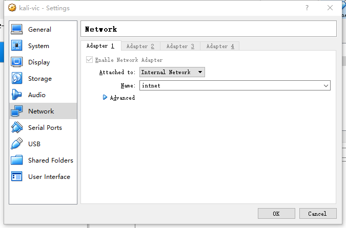
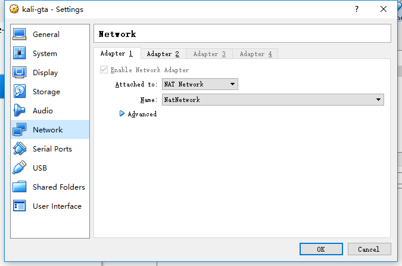
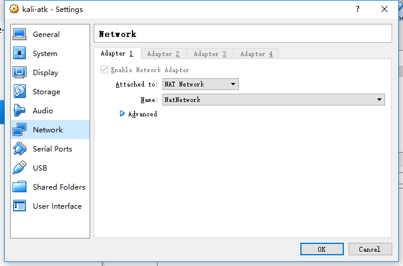
- 进入网关，给内部网络的网卡配置静态IP并重启
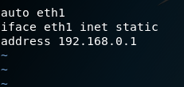
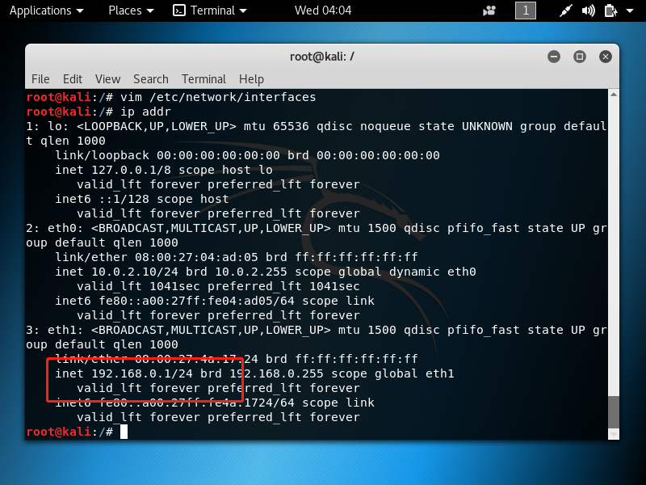
- `apt-get update`和`apt-get install dnsmasq`，网关用来做内网主机的dns服务器
- `/etc/init.d/dnsmasq stop` 停止dnsmasq并在`/etc/dnsmasq.conf`进行配置,配置内如如下
```
interface = eth1
listen-address = 127.0.0.1
bind-interfaces
dhcp-range=192.168.0.50,192.168.0.150,255.255.255.0,12h
```
- 在靶机中配置通过dhcp自动分配ip,重启网络

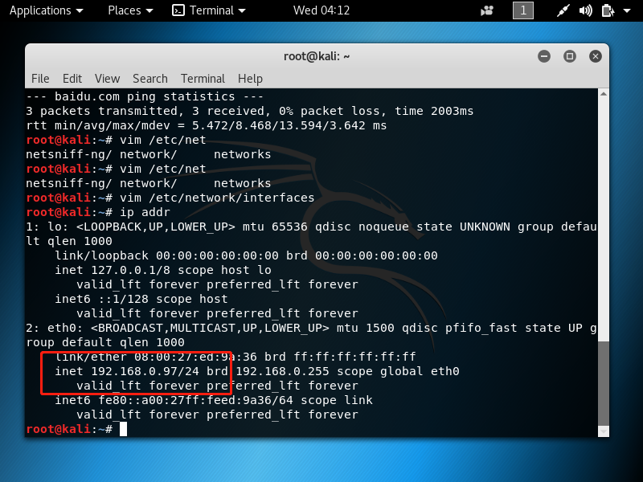
- 到此，网络拓扑基本完成，结构如下
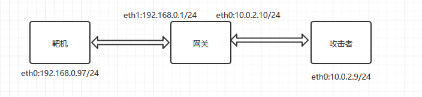
- 网关开启流量转发

- 设置NAT转发规则，将192.168.0.97的所有流量都已10.0.2.9的地址转发出去和接收

- 靶机添加默认网关为网关的eht1的IP地址

- 网关的iptabels的设置，为了防止重启清空，需要保存

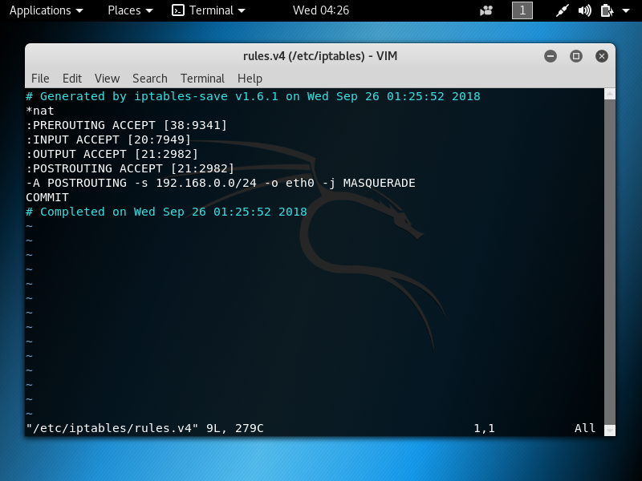

## 检查连通性
- 靶机和网关可以ping通
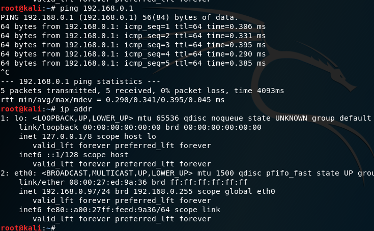
- 靶机可以域名解析并访问互联网
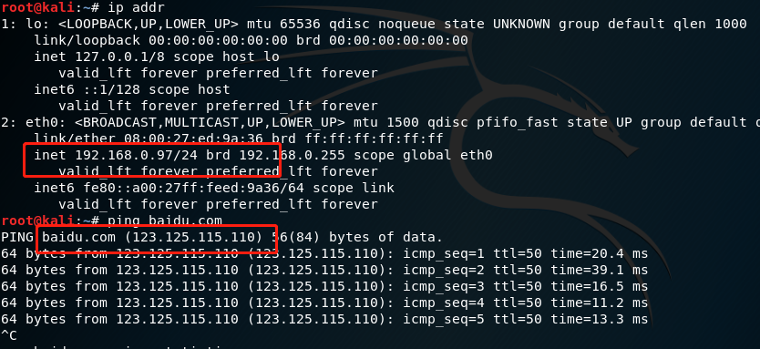
- 靶机可以ping通攻击者主机
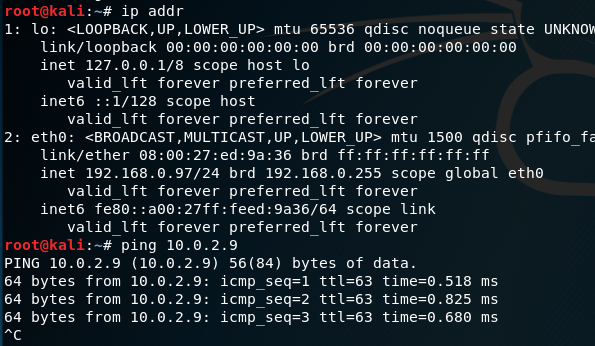
- 网关可以ping通靶机
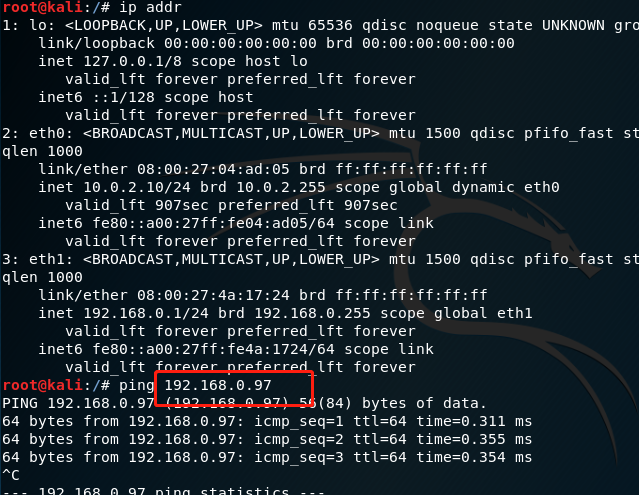
- 网关可以访问互联网
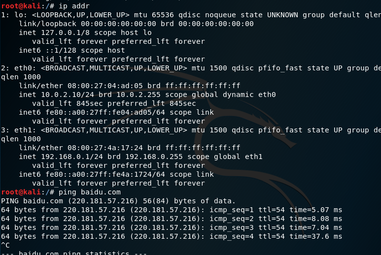
- 网关可以访问攻击者主机
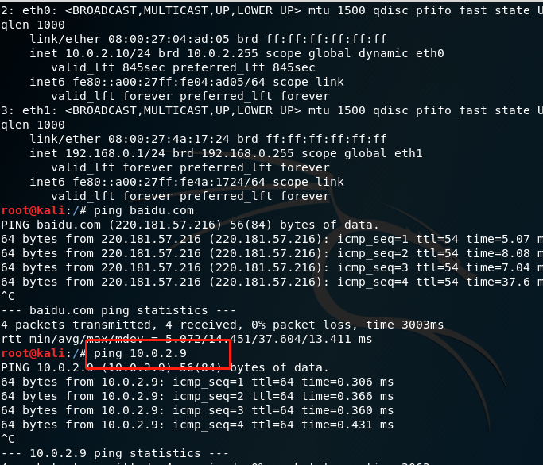
- 攻击者可以ping通网关
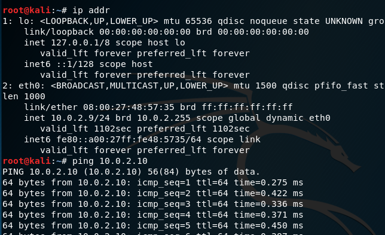
- 攻击者可以访问互联网

- 攻击者无法ping通靶机
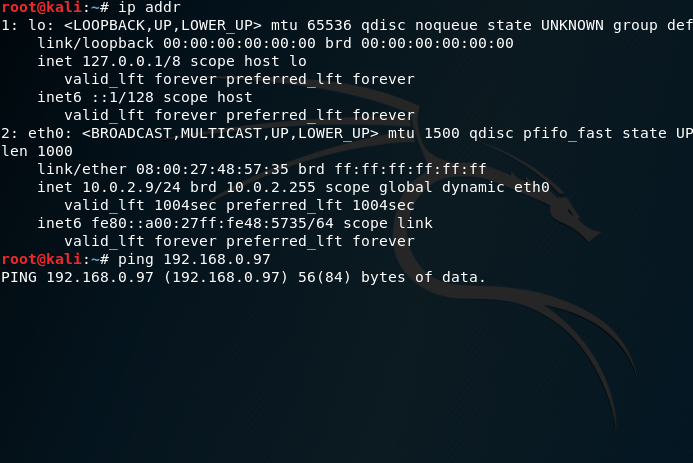


## 遇到的问题

### virtual box 虚拟机未响应
- 声卡冲突，关掉声卡选项

### 网关内部网络网卡未启动
- 手动配置静态IP

### 靶机域名无法解析
- 在网关安装dnsmasq，并进行配置

### 重启iptables清空
- 保存iptables设置iptables-restore

