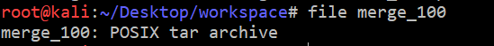

# ns_chap0x12 实战Bro网络入侵取证

## 安装bro

```bash
#禁止交互
export DEBIAN_FRONTEND=noninteractive

#安装bro
apt-get install bro bro-aux
```

## 实验环境基本信息

```bash
root@kali:~# lsb_release -a
No LSB modules are available.
Distributor ID:	Kali
Description:	Kali GNU/Linux Rolling
Release:	kali-rolling
Codename:	kali-rolling
root@kali:~# uname -a
Linux kali 4.17.0-kali1-amd64 #1 SMP Debian 4.17.8-1kali1 (2018-07-24) x86_64 GNU/Linux
root@kali:~# bro -v
bro version 2.5.5
```

## 编辑bro配置文件

- 编辑 `/etc/bro/site/local.bro`，在文件尾部追加两行新配置代码
    ```bash
    @load frameworks/files/extract-all-files
    @load mytuning.bro
    ```
    

- 在`/etc/bro/site/`目录下创建新文件mytuning.bro，内容为:
    ```bash
    #bro默认进行数据包校验和检查,可能会出现报错,这里我们无视校验和
    redef ignore_checksums = T;

    #ftp.log中默认不会显示捕获的FTP登录口令,我们可以通过在/etc/bro/site/mytuning.bro 中增加以下变量重定义来实现
    redef FTP::default_capture_password = T;
    ```
    

## 使用bro分析pcap文件

- 利用bro分析pcap文件，执行下面命令
    ```bash
    bro -r attack-trace.pcap /etc/bro/site/local.bro
    ```
    

- 执行完之后，在attack-trace.pcap文件夹下会产生一些日志文件以及extract_files目录<br>
- extract_files目录下有一个可执行文件<br>

- 将该文件上传至[virustotal](https://www.virustotal.com/),匹配了一个历史扫描报告，判断这是一个后门程序<br><br>

- `FHUsSu3rWdP07eRE4l`是该文件的唯一表示,根据此标识在file.log中找到对应的会话标识` CUZOup3FYPDNCF2T1f`<br><br>

- 查看`conn.log`中所有可用列名
    ```bash
    grep ^#fields conn.log | tr '\t' '\n'
    ```
    

- 使用`bro-cut`关注我们想要的列,并通过`grep`只查看`CUZOup3FYPDNCF2T1f`对应的信息,可知来源ip`98.114.205.102`

    ```bash
     cat conn.log | bro-cut -d ts uid id.orig_h id.orig_p id.resp_h id_resp_p proto | grep CUZOup3FYPDNCF2T1f
    ```
    

- 查看`ftp.log`中的`user`和`password`
    ```bash
    cat ftp.log  | bro-cut uid user password
    ```
    

### 某道题的write-up

- 课上说一些CTF题目可能就需要bro这种自动化工具去分析，所以就去桃花岛转了一圈，找了个看起来像是要用到bro的题<br>

- 没有后缀名，`file`一下，貌似是个压缩文件<br>

- 尝试解压,得到包<br>

- 凭感觉`bro`一下,果然提取出了个文件,查看一下文件属性,是个图片,打开图片,flag就赫然写在了图片上,带有flag的图片就不放在这了<br>


