# chap0x05 网络扫描

## 网络结构
- 如图<br>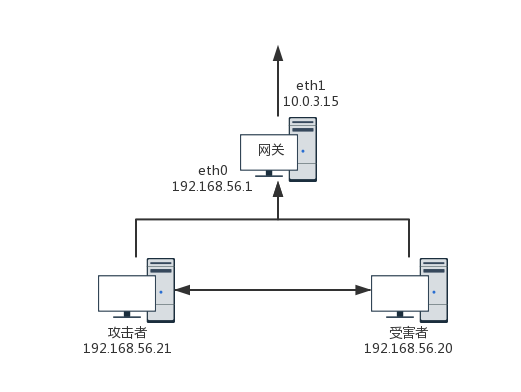

## 实验一 : 局域网的主机扫描

- 扫描内网存活的主机,选择目标主机,结果如下。<br>本实验中,受害者主机的IP地址为`192.168.56.20`


    ```bash
    nmap -sT -A 192.168.56.0/24
    #-sT : TCP connect() scan
    #-A : Enable OS detection, version detection, script scanning, and traceroute
    ```
    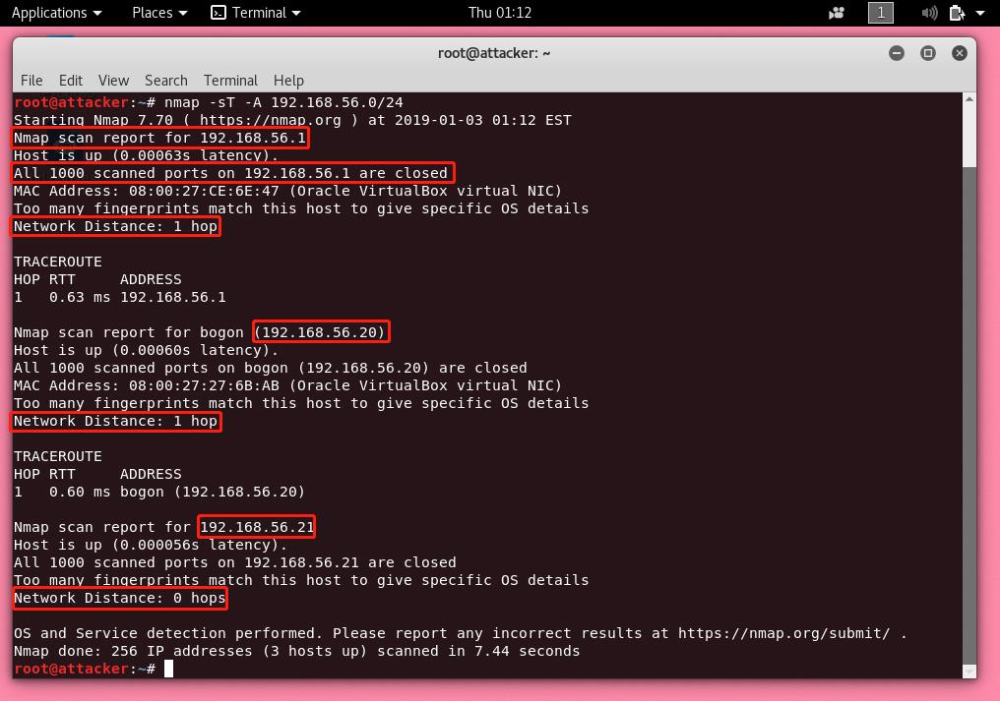

- 扫描该目标主机常见服务
    ```bash
    nmap 192.168.56.20
    ```
- 结果如下,所扫描的1000个端口均关闭<br>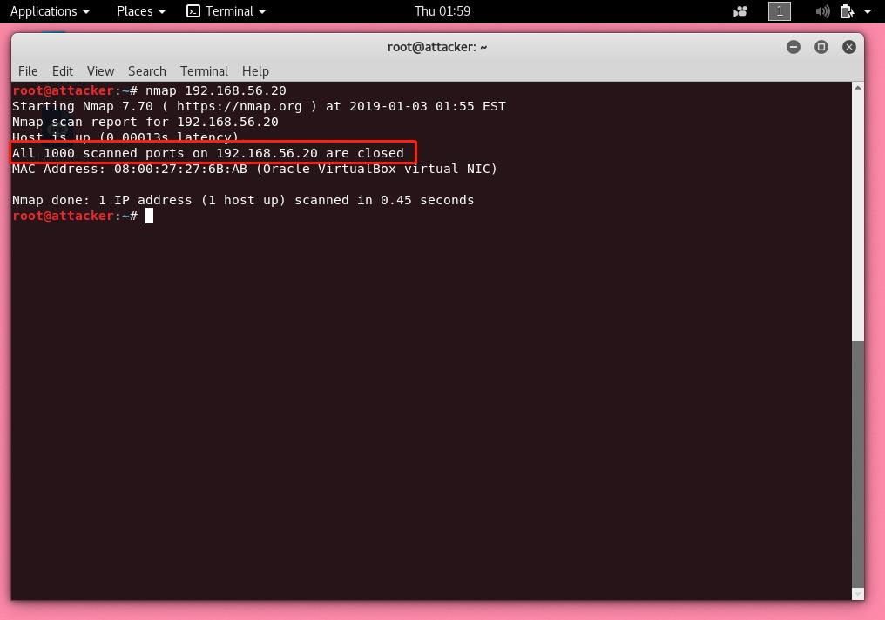

- 受害者主机开启apache服务,默认监听80端口,攻击者同时扫描主机操作系统,查看各个服务详细版本信息
    ```bash
    nmap -sV -O 192.168.56.2
    #-sV : Probe open ports to determine service/version info
    #-O : Enable OS detection
    ```
    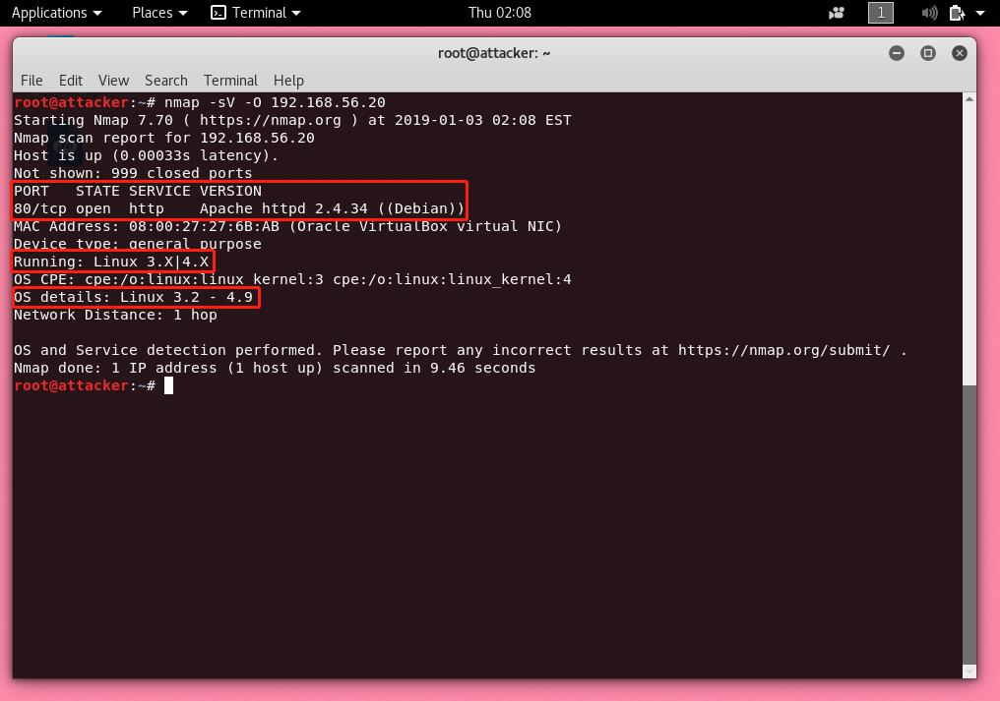


## 实验二 : 局域网拓扑发现
- 通过ZenMap⼯具的使用了解整个局域⽹的拓扑结构<br>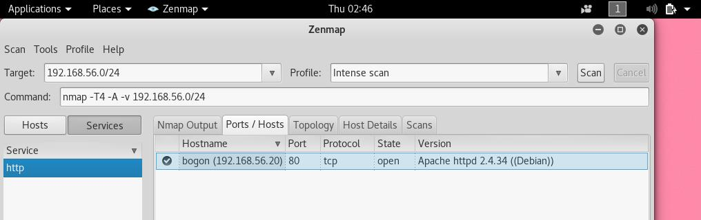<br>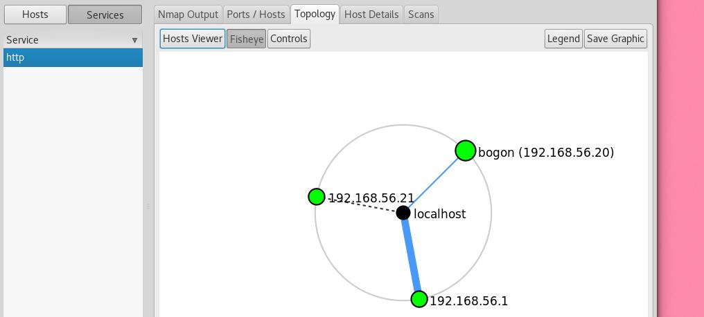

- 使用ZenMap扫描外部网络,拓扑结构如下<br>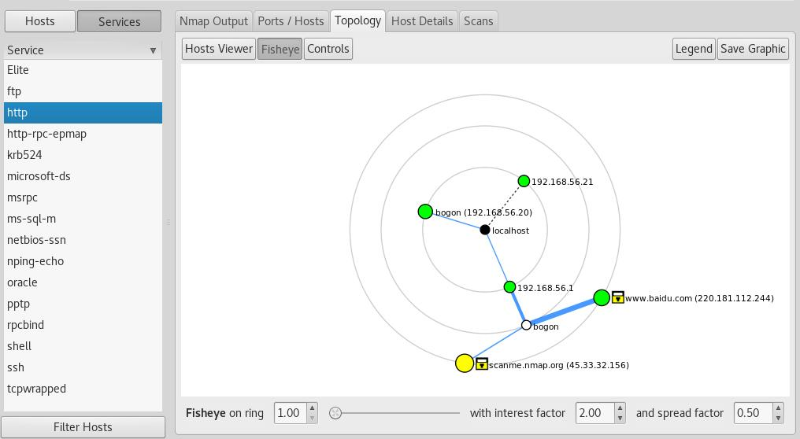

## 实验3 : 编程实现并讲解TCP connect scan/TCP stealth scan/TCP XMAS scan/UDP scan

### Tcp connect

```python

def tcp_connect_scan(dst_ip , dst_port , timeout = 5 , src_port = SRC_PORT):
    #The function sr1() is a variant that only returns one packet that answered the packet (or the packet set) sent
    #The client sends the first handshake using the SYN flag and port to connect to the server in a TCP packet
    tcp_connect_scan_resp = sr1(IP(dst = dst_ip) / TCP(sport = src_port , dport = dst_port , flags = "S") , timeout = timeout)
    if (str(type(tcp_connect_scan_resp)) == "<type 'NoneType'>"):
       print "Closed"
    elif (tcp_connect_scan_resp.haslayer(TCP)):
        #If the server responds with a RST instead of a SYN-ACK, then that particular port is closed on the server.
        if (tcp_connect_scan_resp.getlayer(TCP).flags == 'AS'):#ACK && SYN : 0x12
            send_rst = sr1(IP(dst=dst_ip)/TCP(sport = src_port , dport=dst_port,flags="AR"),timeout=10)
            print "tcp_connect_scan : Open"
        elif (tcp_connect_scan_resp.getlayer(TCP).flags == 'AR'):#ACK && RST : 0x14
            print "tcp_connect_scan : Close
```

- 运行代码,其中`dst_ip = 192.168.56.20`,`dst_port = 80`,结果如下,显示其为Close,通常意味着受害者主机的80端口为关闭状态<br>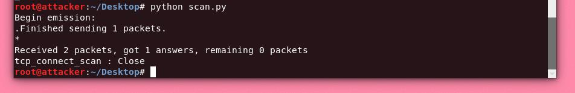
- 受害者主机抓包分析可发现,攻击者发送SYN包,受害者回复了一个RST+ACK包<br>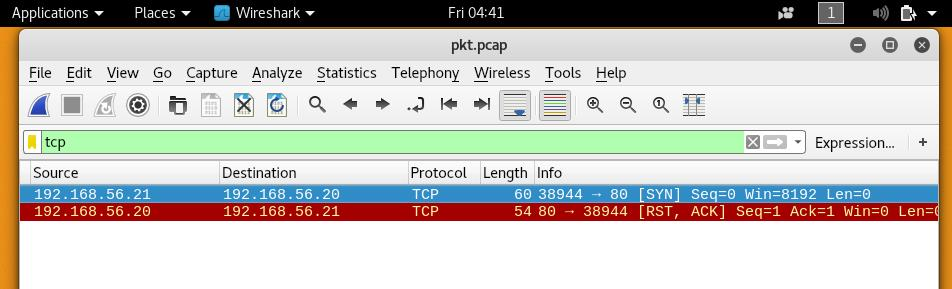
- 使用nmap进行扫描,结果一致,为关闭状态<br>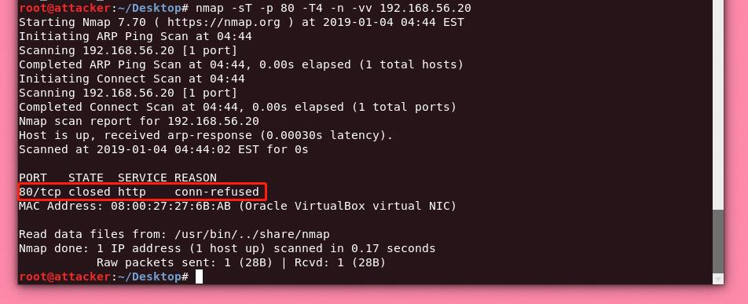


- 使用netcat监听80端口
    ```bash
    nc -l -p 80
    #-l : listen mode, for inbound connects
    #-p : port      local port number (port  numbers  can  be  individual  or  ranges:  lo-hi[inclusive])
    ```
- 再次运行代码,结果如下,显示其为开启状态<br>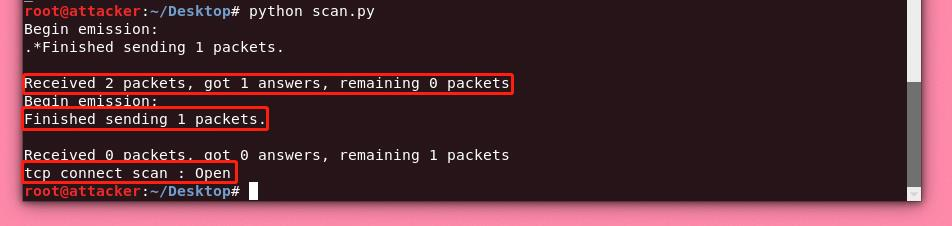
- 受害者主机进行抓包分析,攻击者向受害者发送了一个SYN包,受害者返回SYN+ACK,然后攻击者回复RST+ACK <br>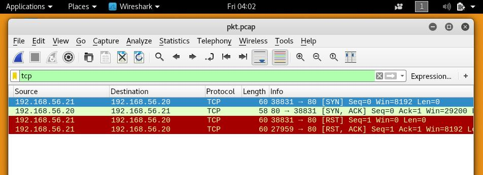
- 这里有攻击者主机发送的包里有两个包含RST,第一个端口为38831,是自动回复的,第二个端口为27959的,是代码中主动发送的,分别发送SYN包和ACK+RST包,受害者主机抓包如下<br>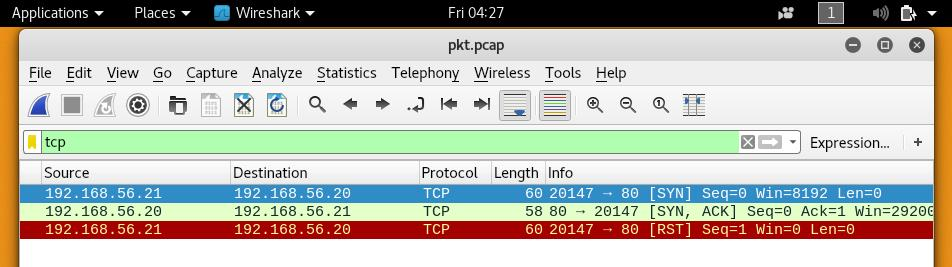<br>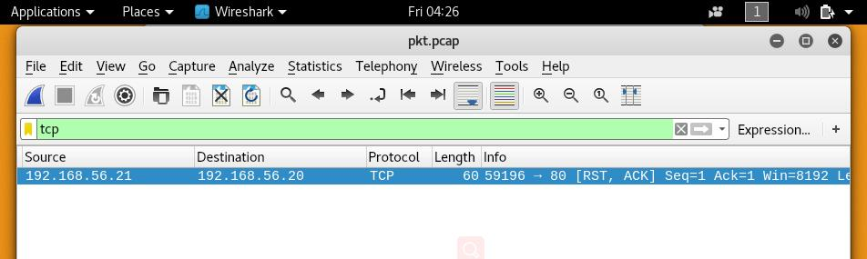

- 使用nmap进行扫描,结果一致<br>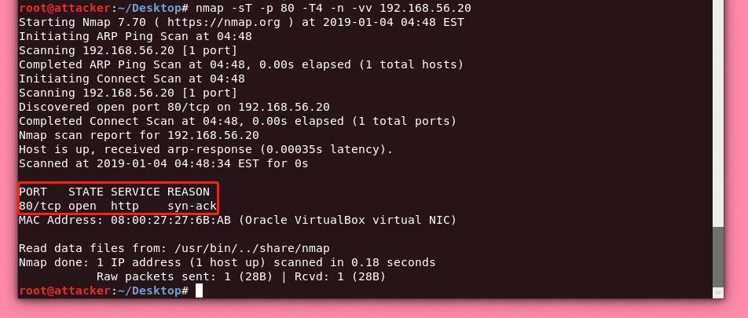

- 攻击者添加iptables规则`iptables -A INPUT -p tcp --dport 80 -j DROP`,过滤发向端口80的tcp包
- 再次运行代码<br>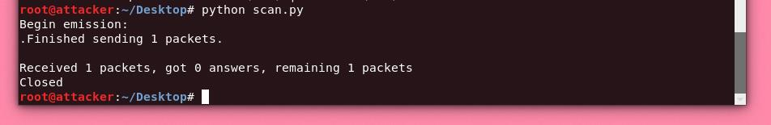
- 受害者主机抓包结果如下,可以看出这个包被忽略掉了,没有任何回复<br>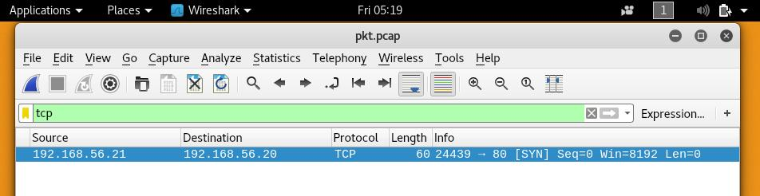

### TCP stealth scan

```python
def tcp_stealth_scan(dst_ip , dst_port , timeout = 5 , src_port = SRC_PORT):
    #This technique is similar to the TCP connect scan. The client sends a TCP packet with the SYN flag set and the port number to connect to
    stealth_scan_resp = sr1(IP(dst=dst_ip)/TCP(sport=src_port,dport=dst_port,flags="S"),timeout=timeout)
    if(str(type(stealth_scan_resp))=="<type 'NoneType'>"):
        print "Filtered"
    elif(stealth_scan_resp.haslayer(TCP)):
        #If the port is open, the server responds with the SYN and ACK flags inside a TCP packet
        if(stealth_scan_resp.getlayer(TCP).flags == 'AS'):#ACK && SYN : 0x12
            #But this time the client sends a RST flag in a TCP packet and not RST+ACK, which was the case in the TCP connect scan. This technique is used to avoid port scanning detection by firewalls.
            send_rst = sr(IP(dst=dst_ip)/TCP(sport=src_port,dport=dst_port,flags="R"),timeout=timeout)
            print "Open"
        elif (stealth_scan_resp.getlayer(TCP).flags == 'AR'):#ACK && RST : 0x14
            #The closed port check is same as that of TCP connect scan. The server responds with an RST flag set inside a TCP packet to indicate that the port is closed on the server
            print "Closed"
    elif(stealth_scan_resp.haslayer(ICMP)):
        #ICMP type 3, Destination unreachable message
        #code 1 : Host unreachable error.
        #code 2 : Protocol unreachable error.Sent when the designated transport protocol is not supported.
        #code 3 : Port unreachable error. Sent when the designated transport protocol is unable to demultiplex the datagram but has no protocol mechanism to inform the sender.
        #code 9 : The destination network is administratively prohibited.
        #code 10 : The destination host is administratively prohibited.
        #code 13 : Communication Administratively Prohibited.This is generated if a router cannot forward a packet due to administrative filtering.
        if(int(stealth_scan_resp.getlayer(ICMP).type)==3 and int(stealth_scan_resp.getlayer(ICMP).code) in [1,2,3,9,10,13]):
            print "Filtered"
```

- 受害者主机未开启80端口,运行代码，其中`dst_ip = 192.168.56.20`,`dst_port = 80`,显示结果为Close，通常意味着80端口关闭<br>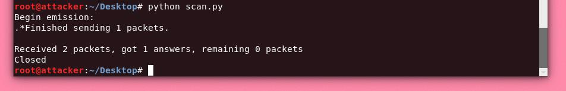

- 抓包分析可知，攻击者发送SYN包，受害者返回RST+ACK<br>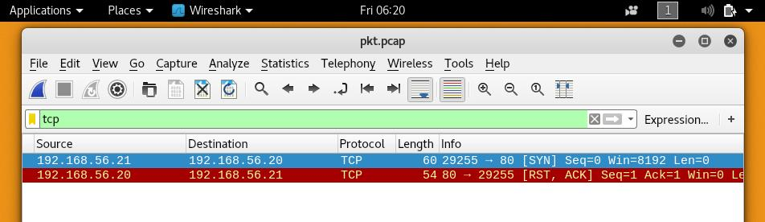

- 使用nmap扫描，结果一致<br>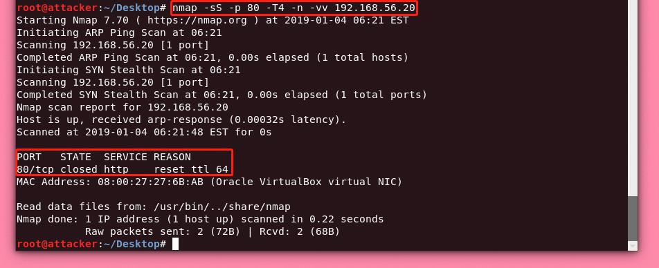

- 受害者主机使用`nc -l -p 80`开启80端口的监听
- 再次运行代码，结果如下，显示为Open状态<br>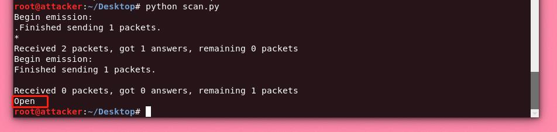

- 抓包分析可知，攻击者发送SYN包，受害者返回ACK+SYN，攻击者发送RST包，其中有两个RST包，端口为49277的是自动发送，端口号为2777的是代码中主动发送的<br>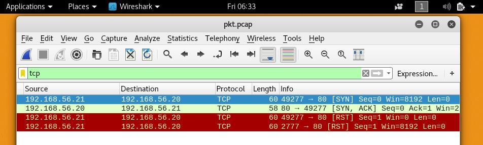

- 使用nmap扫描，结果一致<br>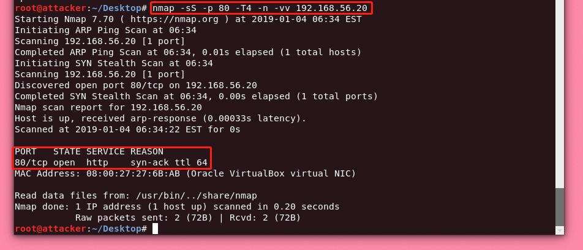

- 受害者主机添加规则`iptables -A INPUT -p tcp --dport 80 -j REJECT --reject-with icmp-port-unreachable`

- 运行代码，显示为Filtered，结果如下<br>
- 抓包分析可知，返回ICMP包，type为3(Destination unreachalbe，code为3(port unreachable)<br>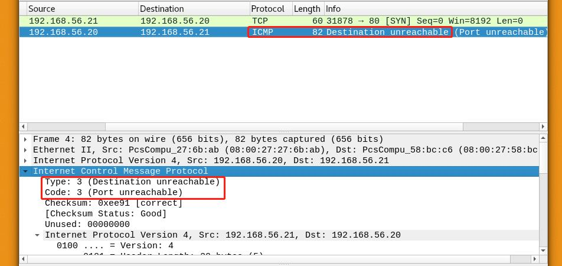
- 使用nmap扫描，结果一致<br>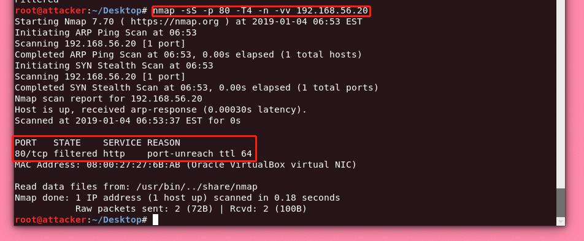

### XMAS scan

```python
def xmas_scan(dst_ip , dst_port , timeout = 5,src_port = SRC_PORT):
    #In the XMAS scan, a TCP packet with the PSH, FIN, and URG flags set, along with the port to connect to, is sent to the server.
    xmas_scan_resp = sr1(IP(dst=dst_ip)/TCP(dport=dst_port,flags="FPU"),timeout=10)
    #If the port is open, then there will be no response from the server.
    if (str(type(xmas_scan_resp))=="<type 'NoneType'>"):
        print "Open|Filtered"
    elif(xmas_scan_resp.haslayer(TCP)):
        #If the server responds with the RST flag set inside a TCP packet, the port is closed on the server.
        if(xmas_scan_resp.getlayer(TCP).flags == 'AR'):#
            print "Closed"
    elif(xmas_scan_resp.haslayer(ICMP)):
        #If the server responds with the ICMP packet with an ICMP unreachable error type 3 and ICMP code 1, 2, 3, 9, 10, or 13, then the port is filtered and it cannot be inferred from the response whether the port is open or closed.
        if(int(xmas_scan_resp.getlayer(ICMP).type)==3 and int(xmas_scan_resp.getlayer(ICMP).code) in [1,2,3,9,10,13]):
            print "Filtered"
```

- 受害者主机80端口关闭,运行上述代码,其中`dst_ip = 192.168.56.20`,`dst_port = 80`,结果显示`Close`,如图<br>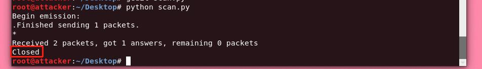

- 受害者主机抓包分析,可知,攻击者向受害者主机发送带有`PSH`,`UGR`,`FIN`标志位的TCP包,受害者主机回复`RST`+`ACK`<br>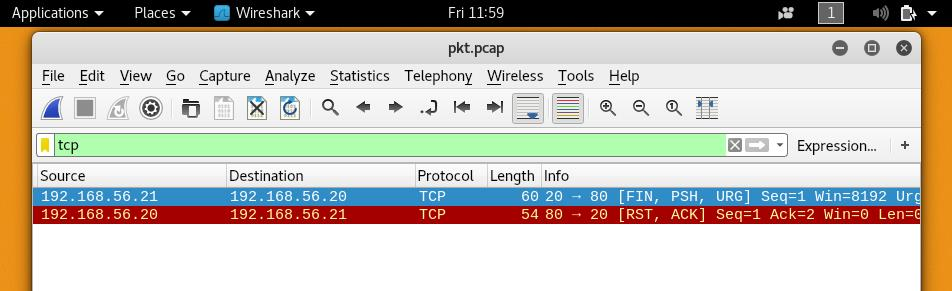

- 使用nmap扫描,结果一致,其中`-sX`表示使用`xmas scan`.<br>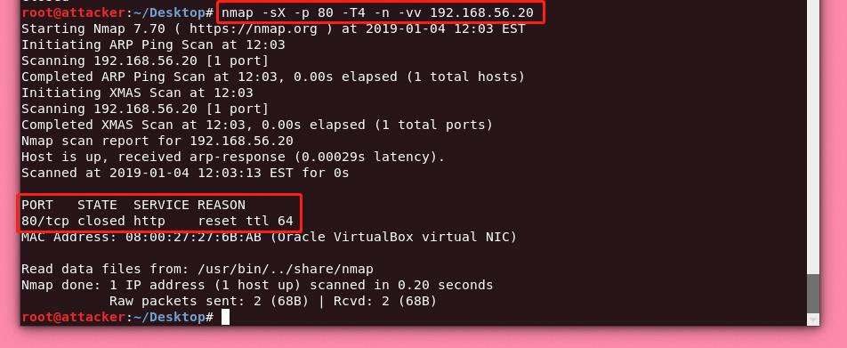

- 受害者开启80端口,再次执行上述代码,显示`Open|Filter`,如图<br>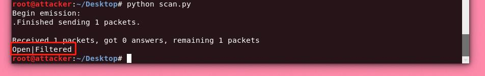

- 抓包分析,这一次受害者主机没有任何回复<br>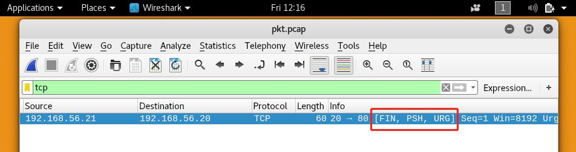

- 使用nmap扫描,结果一致,如图<br>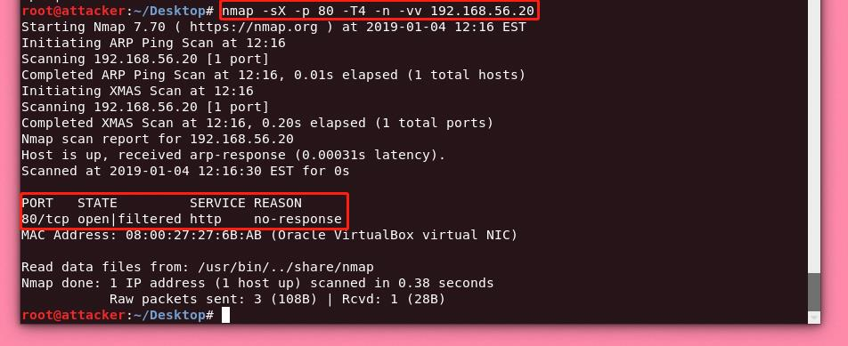

- 受害者主机添加规则`iptables -A INPUT -p tcp --dport 80 -j REJECT --reject-with icmp-port-unreachable`

- 再次运行代码,结果如下<br>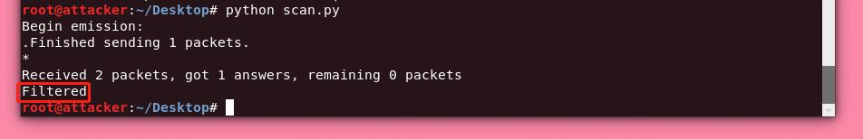

- 抓包分析,返回了ICMP包,type3,code3<br>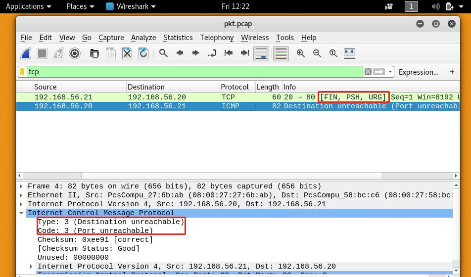

- 使用nmap扫描,结果一致,如图<br>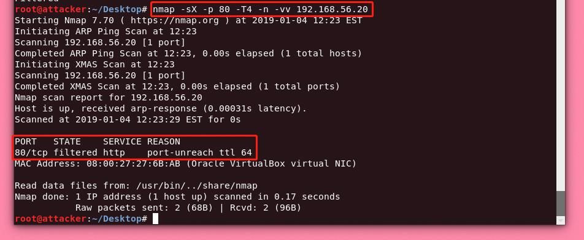


### FIN scan

```python
def fin_scan(dst_ip , dst_port , timeout = 5 , src_port = SRC_PORT):
    #The FIN scan utilizes the FIN flag inside the TCP packet, along with the port number to connect to on the server
    fin_scan_resp = sr1(IP(dst=dst_ip)/TCP(dport=dst_port,flags="F"),timeout=timeout)
    # If there is no response from the server, then the port is open.
    if (str(type(fin_scan_resp))=="<type 'NoneType'>"):
        print "Open|Filtered"

    elif(fin_scan_resp.haslayer(TCP)):
        #If the server responds with an RST flag set in the TCP packet for the FIN scan request packet, then the port is closed on the server.
        if(fin_scan_resp.getlayer(TCP).flags == 'AR'):#ACK && RST : 0x14
            print "Closed"
    elif(fin_scan_resp.haslayer(ICMP)):
        #An ICMP packet with ICMP type 3 and code 1, 2, 3, 9, 10, or 13 in response to the FIN scan packet from the client means that the port is filtered and the port state cannot be found.
        if(int(fin_scan_resp.getlayer(ICMP).type)==3 and int(fin_scan_resp.getlayer(ICMP).code) in [1,2,3,9,10,13]):
            print "Filtered"
```

- 受害者主机80端口关闭,运行上述代码,其中`dst_ip = 192.168.56.20`,`dst_port = 80`,结果显示`Close`,如图<br>

- 受害者主机抓包分析,可知,攻击者向受害者主机发送带有FIN`标志位的TCP包,受害者主机回复`RST`+`ACK`<br>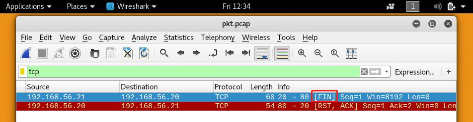

- 使用nmap扫描,结果一致,其中`-sF`表示使用`FIN scan`.<br>

- 受害者开启80端口,再次执行上述代码,显示`Open|Filter`,如图<br>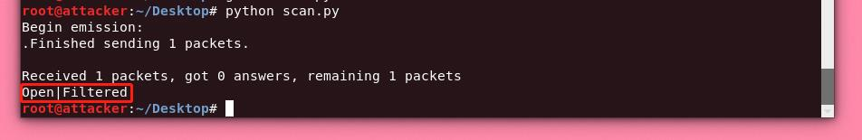

- 抓包分析,这一次受害者主机没有任何回复<br>

- 使用nmap扫描,结果一致,如图<br>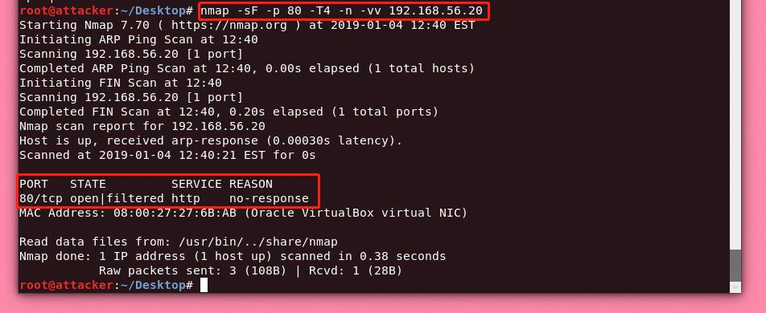

- 受害者主机添加规则`iptables -A INPUT -p tcp --dport 80 -j REJECT --reject-with icmp-port-unreachable`

- 再次运行代码,结果如下<br>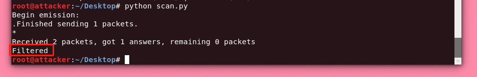

- 抓包分析,返回了ICMP包,type3,code3<br>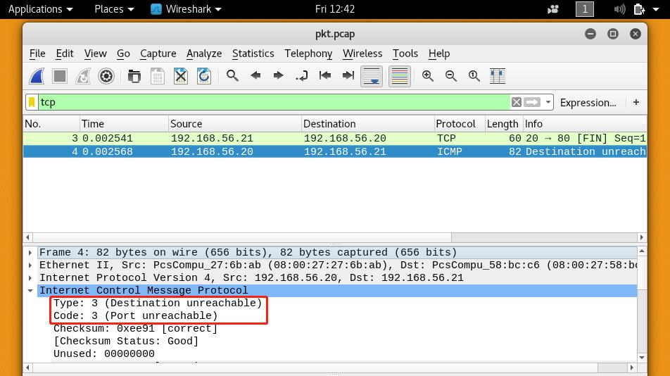

- 使用nmap扫描,结果一致,如图<br>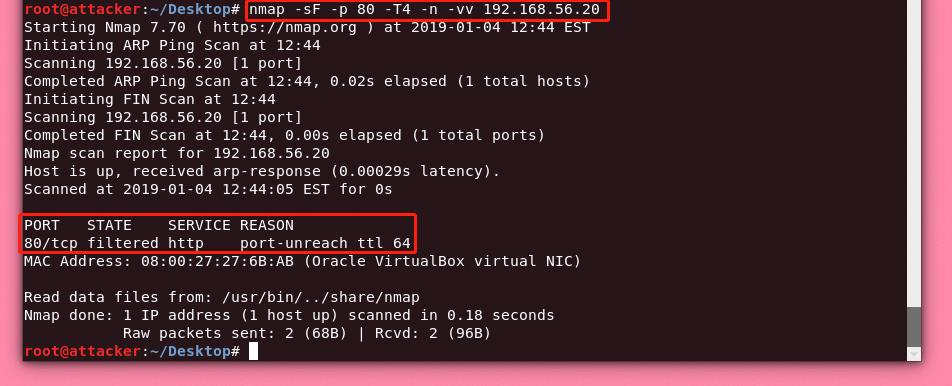

    >其优点是 FIN 数据包能够通过只监测 SYN 包的包过滤器，且隐蔽性高于 SYN 扫描
- 所以我们添加一个过滤SYN包的规则,`iptables -A INPUT -p tcp --tcp-flags SYN SYN -j REJECT --reject-with icmp-port-unreachable`

- 重复上述步骤,同打开80端口,fin_scan饶过了只监测SYN包的包过滤器<br>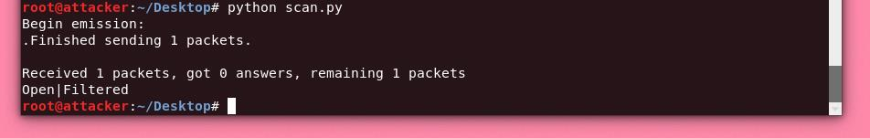<br>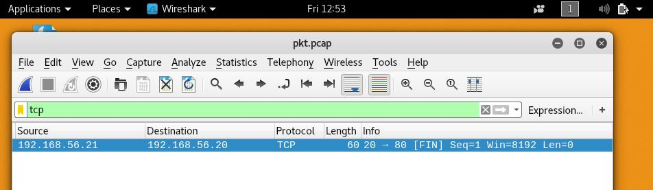<br>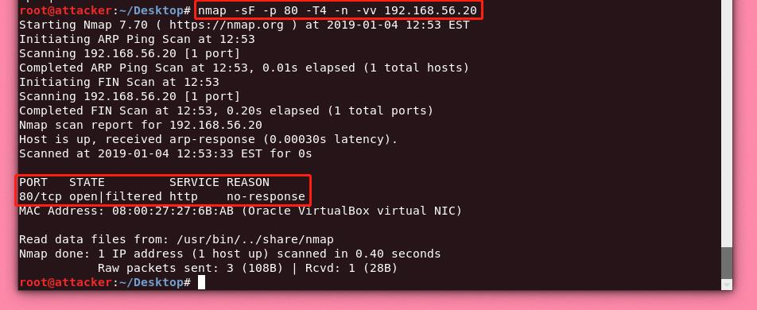


### NULL scan

```python
def null_scan(dst_ip , dst_port , timeout = 5 , src_port = SRC_PORT):
    #In a NULL scan, no flag is set inside the TCP packet. The TCP packet is sent along with the port number only to the server.
    null_scan_resp = sr1(IP(dst=dst_ip)/TCP(dport=dst_port,flags=""),timeout=timeout)
    #If the server sends no response to the NULL scan packet, then that particular port is open.
    if (str(type(null_scan_resp))=="<type 'NoneType'>"):
        print "Open|Filtered"
    #If the server responds with the RST flag set in a TCP packet, then the port is closed on the server.
    elif(null_scan_resp.haslayer(TCP)):
        if(null_scan_resp.getlayer(TCP).flags == 'AR'):#ACK && RTS : 0x14
            print "Closed"

    #An ICMP error of type 3 and code 1, 2, 3, 9, 10, or 13 means the port is filtered on the server.
    elif(null_scan_resp.haslayer(ICMP)):
        if(int(null_scan_resp.getlayer(ICMP).type)==3 and int(null_scan_resp.getlayer(ICMP).code) in [1,2,3,9,10,13]):
            print "Filtered"
```

- 受害者主机80端口关闭,运行代码,显示状态为`Close`,结果如图<br>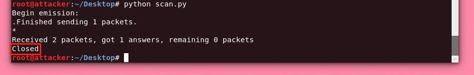

- 抓包分析可知,攻击者发送TCP包,flag标志位均为0,受害者返回RST+ACK<br>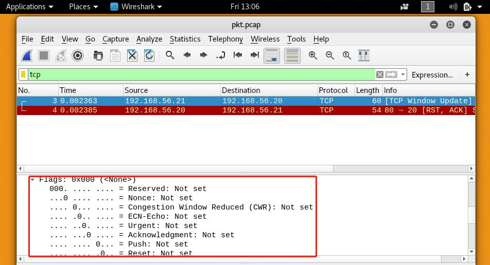

- 使用nmap扫描,结果一致,`sN`为使用`NULL scan`<br>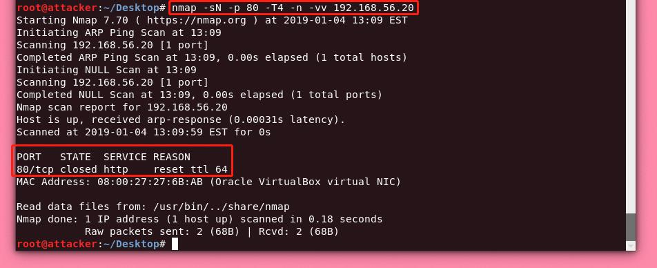

- 开启80端口,再次运行代码,结果如下<br>

- 抓包分析可知,受害者没有任何返回<br>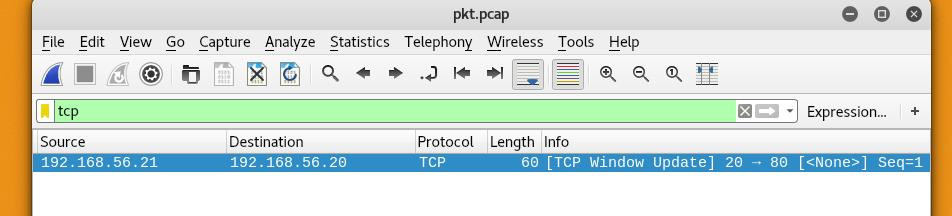

- 使用nmap扫描,结果一致<br>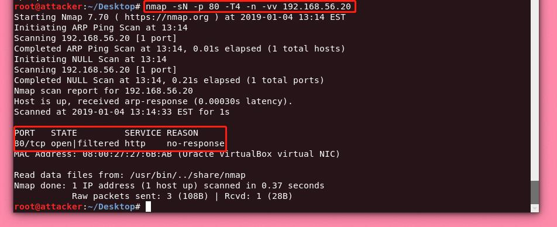


### TCP ACK scan
- ACK scan主要用来判断防火墙是否是启用状态,发送一个带ack的TCP包,如果没有返回,则可能是启用状态,如果返回RST,则没有启用(未过滤该ACK包),如果返回ICMP包说目标不可达,防火墙启用
```python
def tcp_ack_scan(dst_ip , dst_port , timeout = 5,src_port = SRC_PORT):
    #The TCP ACK scan is not used to find the open or closed state of a port; rather, it is used to find if a stateful firewall is present on the server or not. It only tells if the port is filtered or not. This scan type cannot find the open/closed state of the port.

    #A TCP packet with the ACK flag set and the port number to connect to is sent to the server. 
    ack_flag_scan_resp = sr1(IP(dst=dst_ip)/TCP(dport=dst_port,flags="A"),timeout=timeout)
    #If the server doesn’t respond to our TCK ACK scan packet,then the port is filtered and a stateful firewall is present.
    if (str(type(ack_flag_scan_resp))=="<type 'NoneType'>"):
        print "Stateful firewall presentn(Filtered)"

    # If the server responds with the RST flag set inside a TCP packet, then the port is unfiltered and a stateful firewall is absent.
    elif(ack_flag_scan_resp.haslayer(TCP)):
        if(ack_flag_scan_resp.getlayer(TCP).flags == 'R'):#RST : 0x04
            print "No firewalln(Unfiltered)"
    
    #if it responds with a TCP packet with ICMP type 3 or code 1, 2, 3, 9, 10, or 13 set, then the port is filtered and a stateful firewall is present.
    elif(ack_flag_scan_resp.haslayer(ICMP)):
        if(int(ack_flag_scan_resp.getlayer(ICMP).type)==3 and int(ack_flag_scan_resp.getlayer(ICMP).code) in [1,2,3,9,10,13]):
            print "Stateful firewall presentn(Filtered)"
```

- 未开启80端口,执行代码,结果如下<br>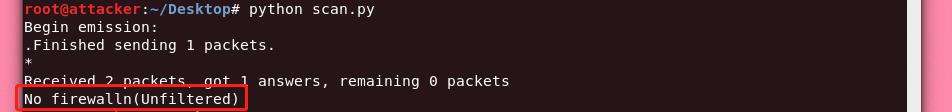

- 抓包分析可知,发送了一个带有ACK标志位的TCP包,返回RST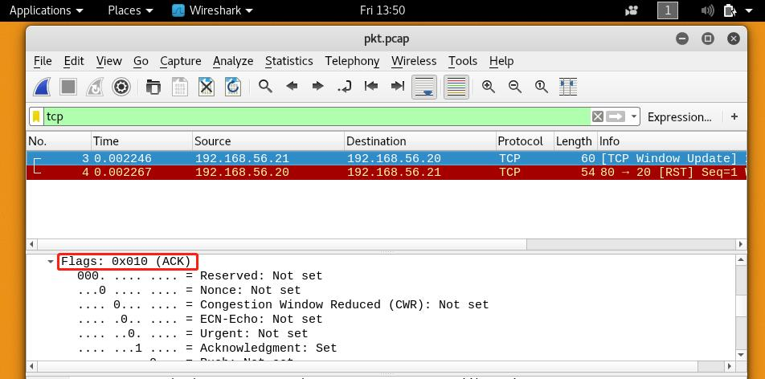

- nmap结果一致,如图<br>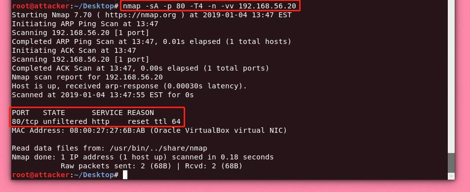

- 开启80端口执行代码,结果如下

- 抓包分析可知,返回了一个RST<br>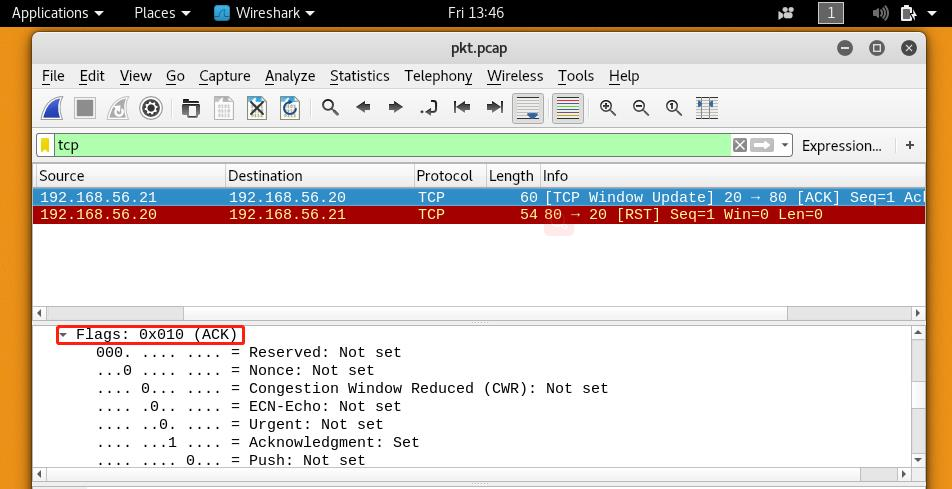

- nmap结果一致,如图<br>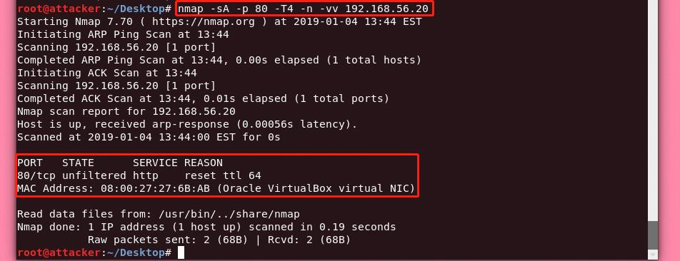

- 受害者主机添加规则`iptables -A INPUT -p tcp --tcp-flags ACK ACK -j REJECT --reject-with icmp-port-unreachable`
- 其运行结果如下,抓包可知返回了一个ICMP包,type3,code3<br><br>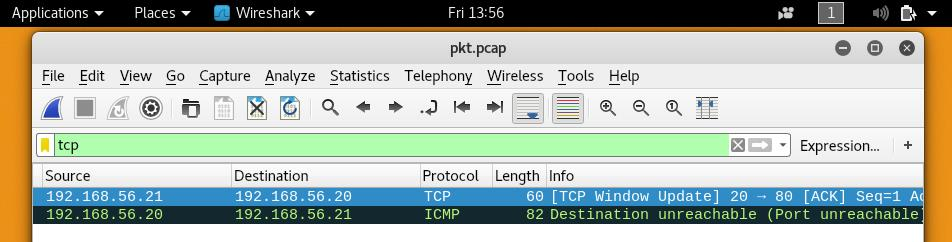<br>

### TCP window scan
- 依然发送ack包,如果rst的window size为0,说明端口可能是关闭,如果大于0,说明是开启状态,然而我的实验中,开启关闭均为0

```python
def tcp_window_scan(dst_ip , dst_port , timeout = 5,src_port = SRC_PORT):
    #A TCP window scan uses the same technique as that of TCP ACK scan.
    # It also sends a TCP packet with the ACK flag set and the port number to connect to
    window_scan_resp = sr1(IP(dst=dst_ip)/TCP(dport=dst_port,flags="A"),timeout=timeout)


    if (str(type(window_scan_resp))=="<type 'NoneType'>"):
        print "No response"

    # in a TCP windows scan, when an RST is received from the server, it then checks the value of the windows size.
    elif(window_scan_resp.haslayer(TCP)):

        #If the windows size of the TCP packet with the RST flag set to zero, then the port is closed on the server.
        if(window_scan_resp.getlayer(TCP).window == 0):
            print "Closed"

        #If the value of window size is positive, then the port is open on the server.
        elif(window_scan_resp.getlayer(TCP).window > 0):
            print "Open"
```

- 受害者主机未开启80端口,运行上述代码,显示`Closed`,结果如下<br>

- 抓包分析可知,受害者主机返回RST,window size为0<br>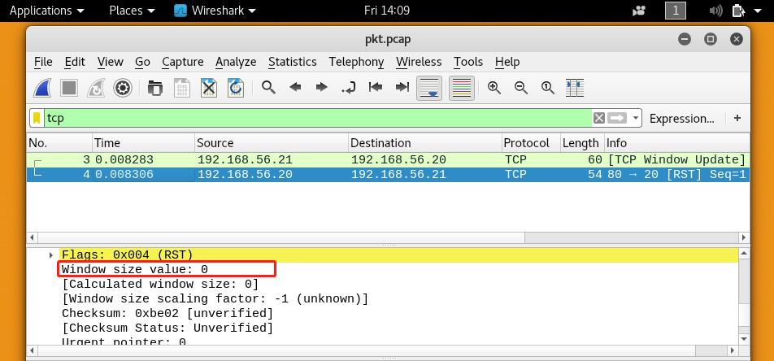

- 使用nmap扫描,结果一致,`-sW`表示使用`tcp window scan`<br>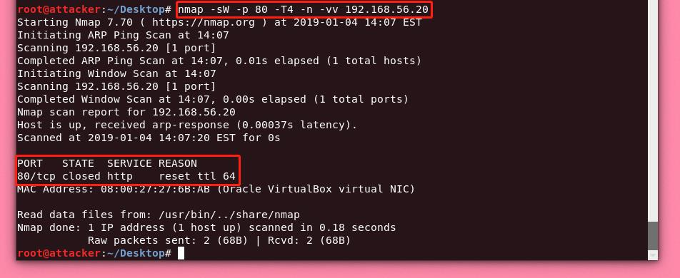

- 受害者主机开启80端口,运行上述代码,显示`Closed`,结果如下<br>

- 抓包分析可知,受害者主机返回RST,window size仍然为0 <br>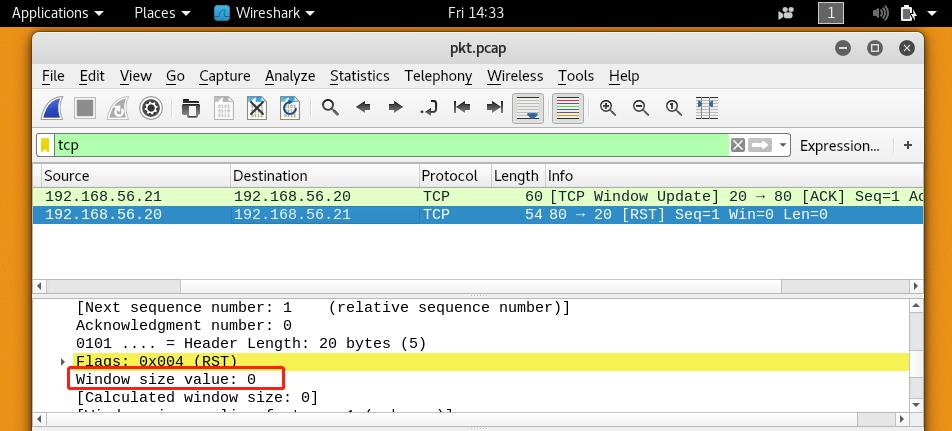

- 使用nmap扫描,结果一致.<br>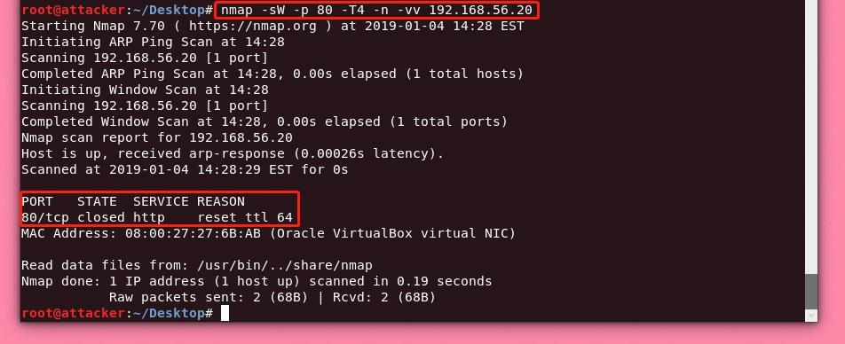

- 此处暂时还没找到原因,猜测可能系统对于这种情况,默认回复中的window size都为0

### UDP scan

```python
def udp_scan(dst_ip,dst_port,dst_timeout = 5):
    #The client sends a UDP packet with the port number to connect to
    udp_scan_resp = sr1(IP(dst=dst_ip)/UDP(dport=dst_port),timeout=dst_timeout)

    #If the server sends no response to the client's UDP request packets for that port,it can be concluded that the port on the server is either open or filtered
    if (str(type(udp_scan_resp))=="<type 'NoneType'>"):
        print "Open|Filtered"
    #If the server responds to the client with a UDP packet, then that particular port is open on the server.
    elif (udp_scan_resp.haslayer(UDP)):
        print "Open"
    elif(udp_scan_resp.haslayer(ICMP)):
        #the server responds with an ICMP port unreachable error type 3 and code 3, meaning that the port is closed on the server.
        if(int(udp_scan_resp.getlayer(ICMP).type)==3 and int(udp_scan_resp.getlayer(ICMP).code)==3):
            print "Closed"
    
        #If the server responds to the client with an ICMP error type 3 and code 1, 2, 9, 10, or 13, then that port on the server is filtered.
        elif(int(udp_scan_resp.getlayer(ICMP).type)==3 and int(udp_scan_resp.getlayer(ICMP).code) in [1,2,9,10,13]):
            print "Filtered"
    elif(udp_scan_resp.haslayer(IP) and udp_scan_resp.getlayer(IP).proto==IP_PROTOS.udp):
        print "Open"
```

- 未开启53端口，运行代码,显示为closed，代码结果和nmap结果如图<br>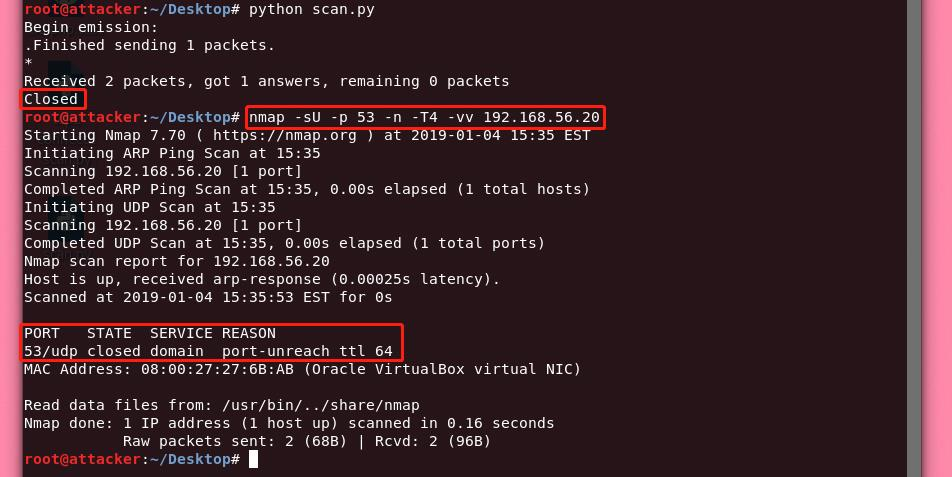

- 抓包分析可发现，攻击者主机向受害者主机发送UDP包，受害者主机回复ICMP包,type3，code3<br>

- 使用`nc -l -u -p 53`开启53端口的监听,运行代码,显示为Open|Filtered,nmap显示为closed,代码结果和nmap结果如图<br>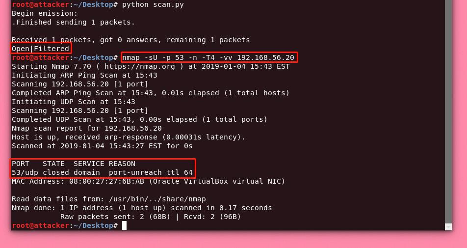

- 抓包分析,发现scapy代码发送UDP包,没有收到任何回复,所以判断可能是Open或者Filtered,nmap向目标地址53端口发送一个DNS请求(使用UDP),收到一个ICMP包回复,type3,code3,所以判断端口为closed<br><br>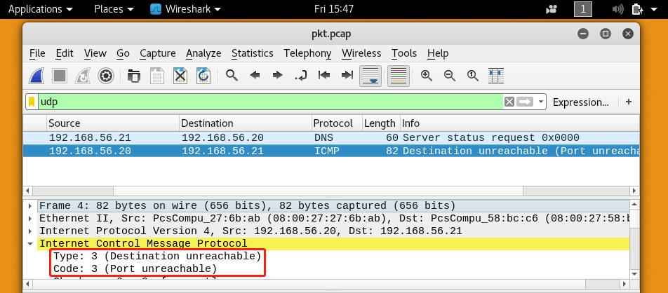

- 通过命令`nc -l -u -p 53 < /etc/passwd`,开启53端口
- 运行代码,一开始显示为Closed,抓包分析后发现,返回一个ICMP包,type3,code3,但是使用的是udp传输,且端口为53,所以可以判断此时端口开启,故代码增加一行如下

    ```python
    elif(udp_scan_resp.haslayer(IP) and udp_scan_resp.getlayer(IP).proto==IP_PROTOS.udp):
        print "Open"
    ```
    <br>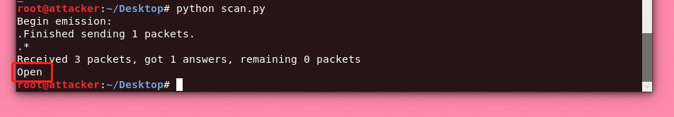<br>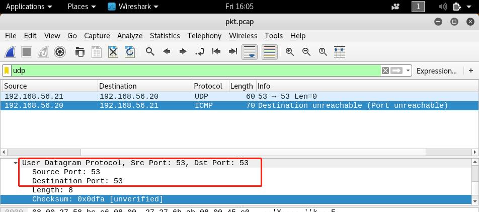

- 使用nmap扫描,显示为open,结果如下<br>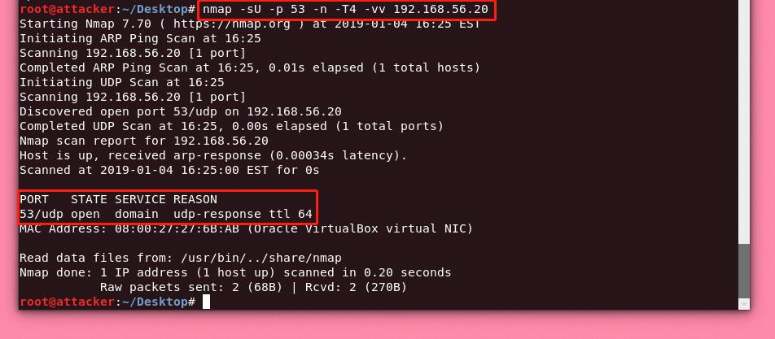

- 抓包分析,可以发现,nmap先向受害者主机以udp方式发送dns请求到53端口

- 受害者主机通过udp传输`/etc/passwd`的文件<br>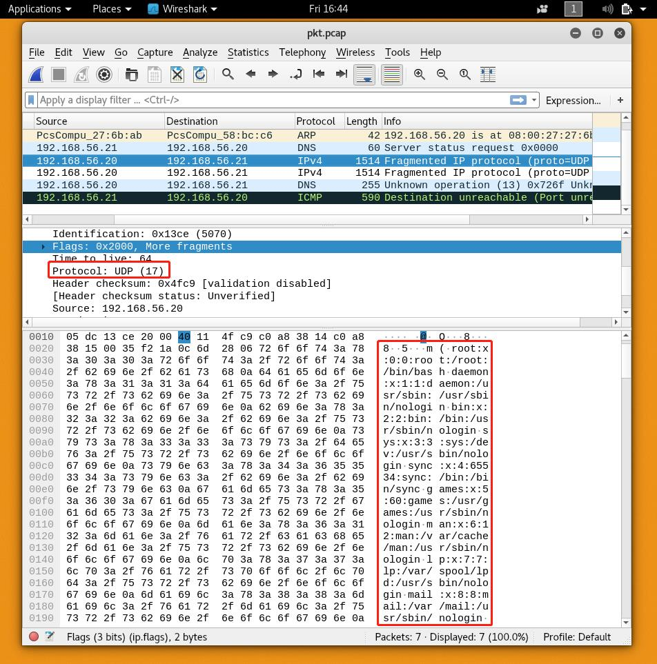

- 然后受害者主机通过53端口以udp方式返回一个dns包,表示这个请求是`unknow operation`<br>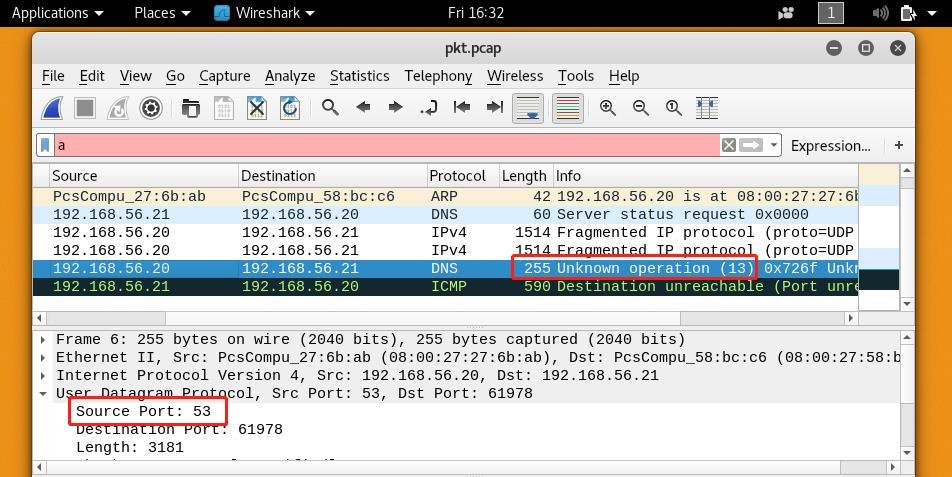

- 最后nmap返回一个ICMP包,type3,code3<br>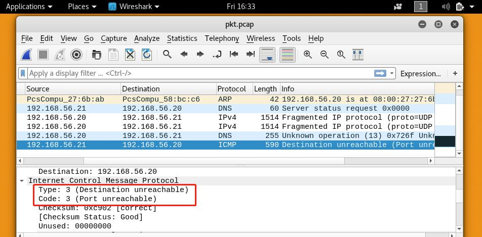


- [ICMP type 3, Destination unreachable message](http://www.networksorcery.com/enp/protocol/icmp/msg3.htm)
- [iptables --tcp-flags](http://bbs.51cto.com/thread-789884-1.html)
- [netcat的正确打开方式](https://www.jianshu.com/p/827f5dc79bbe)
- [https://github.com/CUCCS/2018-NS-Public-xaZKX/blob/ns-chap05/ns-chap05/chap0x05%20%E7%BC%96%E7%A8%8B%E5%AE%9E%E9%AA%8C%E6%8A%A5%E5%91%8A.md](https://github.com/CUCCS/2018-NS-Public-xaZKX/blob/ns-chap05/ns-chap05/chap0x05%20%E7%BC%96%E7%A8%8B%E5%AE%9E%E9%AA%8C%E6%8A%A5%E5%91%8A.md)
- [https://github.com/CUCCS/2018-NS-Public-jckling/blob/ns-0x05/ns-0x05/5.md](https://github.com/CUCCS/2018-NS-Public-jckling/blob/ns-0x05/ns-0x05/5.md)

- [https://www.mkssoftware.com/docs/man1/nc.1.asp](https://www.mkssoftware.com/docs/man1/nc.1.asp)

- [iptables tutorial](http://xahlee.info/linux/linux_iptables_basics.html)
